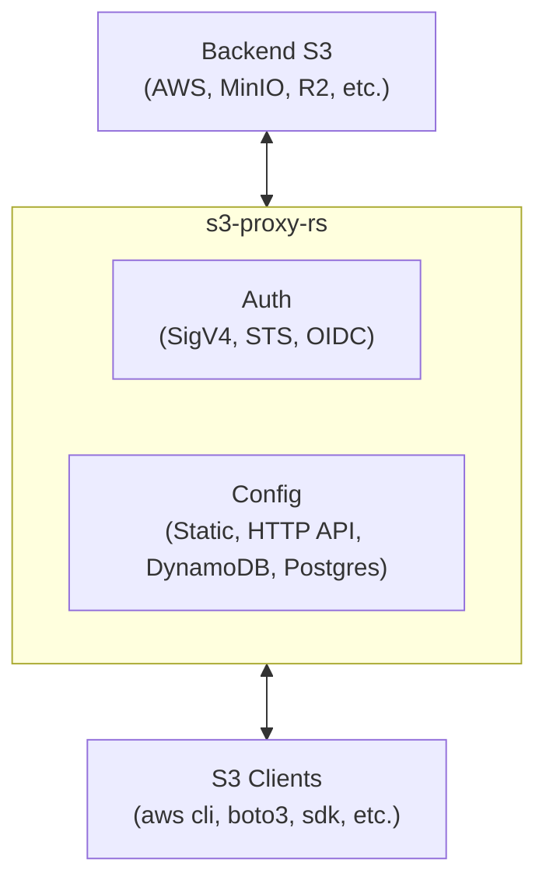

# s3-proxy-rs

A multi-runtime S3 gateway that streams requests to and from backing object stores (S3, MinIO, R2, etc.), providing a unified S3-compliant API with configurable authentication and authorization.

## Architecture



### Crate Layout

```sh
crates/
├── libs/                         # Libraries — not directly runnable
│   ├── core/  (s3-proxy-core)    # Runtime-agnostic: traits, S3 parsing, SigV4, config providers
│   └── sts/   (s3-proxy-sts)     # OIDC/STS token exchange (AssumeRoleWithWebIdentity)
└── runtimes/                     # Runnable targets — one per deployment platform
    ├── server/ (s3-proxy-server) # Tokio/Hyper for container deployments
    └── cf-workers/ (s3-proxy-cf-workers) # Cloudflare Workers for edge deployments
```

Libraries define trait abstractions (`ProxyBackend`, `ConfigProvider`, `RequestResolver`). Runtimes implement `ProxyBackend` with platform-native primitives. The handler uses a two-phase dispatch model: `resolve_request()` returns a `HandlerAction` — either a `Forward` (presigned URL for GET/HEAD/PUT/DELETE), a `Response` (LIST, errors), or `NeedsBody` (multipart). Runtimes execute `Forward` requests with their native HTTP client, enabling zero-copy streaming.

The `RequestResolver` trait decouples "what to do with a request" from the proxy handler. A `DefaultResolver` handles standard S3 proxy behavior (parse, auth, authorize via `ConfigProvider`), while custom resolvers like `SourceCoopResolver` can implement entirely different namespace mapping and authorization schemes.

## Supported Operations

- `GET` (GetObject) — download files
- `HEAD` (HeadObject) — file metadata
- `PUT` (PutObject) — upload files
- `POST` (CreateMultipartUpload, CompleteMultipartUpload) — multipart uploads
- `PUT` with `partNumber` + `uploadId` — upload individual parts
- `DELETE` with `uploadId` — abort multipart uploads
- `GET` on bucket root — ListBucket (v2)
- STS `AssumeRoleWithWebIdentity` — OIDC token exchange

## Quick Start

### Local Development (Docker Compose)

The fastest way to get a running environment with MinIO as the backing store:

```bash
docker compose up
```

This starts MinIO (`:9000` API, `:9001` console) and a seed job that creates example buckets with test data. Then run the proxy using either runtime:

```bash
# Option A: native server runtime
cargo run -p s3-proxy-server -- --config config.local.toml --listen 0.0.0.0:8080

# Option B: Cloudflare Workers runtime (via Wrangler)
cd crates/runtimes/cf-workers && npx wrangler dev
```

Test it:

```bash
# Anonymous read (port 8080 for server, 8787 for worker)
curl http://localhost:8080/public-data/hello.txt

# Signed upload with the local dev credential
AWS_ACCESS_KEY_ID=AKLOCAL0000000000001 \
AWS_SECRET_ACCESS_KEY="localdev/secret/key/00000000000000000000" \
aws s3 cp ./myfile.txt s3://private-uploads/myfile.txt \
    --endpoint-url http://localhost:8080

# Browse MinIO directly
open http://localhost:9001  # user: minioadmin / pass: minioadmin
```

The server runtime reads `config.local.toml` (TOML, backend endpoints use `http://localhost:9000`). The worker runtime reads `PROXY_CONFIG` from `crates/runtimes/cf-workers/wrangler.toml` (JSON, same endpoints).

### Container Deployment

```bash
# Build
cargo build --release -p s3-proxy-server

# Run with a config file
./target/release/s3-proxy --config config.toml --listen 0.0.0.0:8080

# Or with Docker
docker build -t s3-proxy .
docker run -v ./config.toml:/etc/s3-proxy/config.toml -p 8080:8080 s3-proxy
```

### Client Usage

```bash
# Anonymous access to a public bucket
curl http://localhost:8080/public-data/path/to/file.txt

# Signed request with aws-cli (using long-lived credentials)
aws s3 cp s3://ml-artifacts/models/latest.pt ./latest.pt \
    --endpoint-url http://localhost:8080

# GitHub Actions OIDC → STS → S3
# Step 1: Exchange OIDC token for temporary credentials
CREDS=$(aws sts assume-role-with-web-identity \
    --role-arn github-actions-deployer \
    --web-identity-token "$ACTIONS_ID_TOKEN" \
    --endpoint-url http://localhost:8080)

# Step 2: Use temporary credentials to access S3
AWS_ACCESS_KEY_ID=$(echo $CREDS | jq -r .AccessKeyId) \
AWS_SECRET_ACCESS_KEY=$(echo $CREDS | jq -r .SecretAccessKey) \
AWS_SESSION_TOKEN=$(echo $CREDS | jq -r .SessionToken) \
aws s3 cp ./bundle.tar.gz s3://deploy-bundles/releases/v1.2.3.tar.gz \
    --endpoint-url http://localhost:8080
```

## Configuration

See `config.example.toml` for a full example. The config defines three things: virtual buckets (mapping client-visible names to backing stores), IAM roles (trust policies for OIDC token exchange), and long-lived credentials (static access keys).

### Configuration Providers

The proxy supports multiple backends for retrieving configuration, selectable at build time via feature flags or by choosing a different provider at runtime.

#### Static File (always available)

```rust
use s3_proxy_core::config::static_file::StaticProvider;

let provider = StaticProvider::from_file("config.toml")?;
// or
let provider = StaticProvider::from_toml(include_str!("../config.toml"))?;
// or from JSON (useful for Workers env vars)
let provider = StaticProvider::from_json(&json_string)?;
```

#### HTTP API (`config-http` feature)

Fetches config from a centralized REST API. Useful with a control plane service.

```rust
use s3_proxy_core::config::http::HttpProvider;

let provider = HttpProvider::new(
    "https://config-api.internal:8080".to_string(),
    Some("Bearer my-api-token".to_string()),
);
```

Expected endpoints: `GET /buckets`, `GET /buckets/{name}`, `GET /roles/{id}`, etc.

#### DynamoDB (`config-dynamodb` feature)

Single-table design with PK/SK pattern. Build with:

```bash
cargo build -p s3-proxy-server --features s3-proxy-core/config-dynamodb
```

```rust
use s3_proxy_core::config::dynamodb::DynamoDbProvider;

let client = aws_sdk_dynamodb::Client::new(&aws_config);
let provider = DynamoDbProvider::new(client, "s3-proxy-config".to_string());
```

#### PostgreSQL (`config-postgres` feature)

```bash
cargo build -p s3-proxy-server --features s3-proxy-core/config-postgres
```

```rust
use s3_proxy_core::config::postgres::PostgresProvider;

let pool = sqlx::PgPool::connect("postgres://localhost/s3proxy").await?;
let provider = PostgresProvider::new(pool);
```

#### Implementing a Custom Provider

Implement the `ConfigProvider` trait to plug in your own config backend. Then wrap it in `DefaultResolver` to get standard S3 proxy behavior (path/virtual-host parsing, auth, authorization):

```rust
use s3_proxy_core::config::ConfigProvider;
use s3_proxy_core::error::ProxyError;
use s3_proxy_core::types::*;

#[derive(Clone)]
struct MyProvider { /* ... */ }

impl ConfigProvider for MyProvider {
    async fn list_buckets(&self) -> Result<Vec<BucketConfig>, ProxyError> { todo!() }
    async fn get_bucket(&self, name: &str) -> Result<Option<BucketConfig>, ProxyError> { todo!() }
    async fn get_role(&self, role_id: &str) -> Result<Option<RoleConfig>, ProxyError> { todo!() }
    async fn get_credential(&self, access_key_id: &str) -> Result<Option<StoredCredential>, ProxyError> { todo!() }
    async fn store_temporary_credential(&self, cred: &TemporaryCredentials) -> Result<(), ProxyError> { todo!() }
    async fn get_temporary_credential(&self, access_key_id: &str) -> Result<Option<TemporaryCredentials>, ProxyError> { todo!() }
}
```

#### Implementing a Custom Request Resolver

For full control over request routing, authentication, and namespace mapping, implement the `RequestResolver` trait directly. This is useful when your URL namespace doesn't map to a simple bucket/key structure, or when authorization is handled by an external service.

```rust
use s3_proxy_core::resolver::{RequestResolver, ResolvedAction, ListRewrite};
use s3_proxy_core::error::ProxyError;
use s3_proxy_core::types::BucketConfig;
use http::{Method, HeaderMap};
use bytes::Bytes;

#[derive(Clone)]
struct MyResolver { /* ... */ }

impl RequestResolver for MyResolver {
    async fn resolve(
        &self,
        method: &Method,
        path: &str,
        query: Option<&str>,
        headers: &HeaderMap,
    ) -> Result<ResolvedAction, ProxyError> {
        // Parse the path, authenticate, authorize, and return either:
        // - ResolvedAction::Proxy { operation, bucket_config, list_rewrite }
        //   to forward to a backend
        // - ResolvedAction::Response { status, headers, body }
        //   to return a synthetic response (e.g., virtual directory listing)
        todo!()
    }
}
```

The `ResolvedAction::Proxy` variant supports an optional `ListRewrite` for rewriting `<Key>` and `<Prefix>` values in S3 list response XML, which is useful when the backend prefix differs from what clients expect.

Wire it into the proxy handler in your runtime:

```rust
let resolver = MyResolver::new(/* ... */);
let handler = ProxyHandler::new(backend, resolver);
let action = handler.resolve_request(method, path, query, &headers).await;
// Handle action: Forward (presigned URL), Response, or NeedsBody (multipart)
```

### Caching Configuration

Wrap any provider with `CachedProvider` to add in-memory TTL-based caching. This is recommended for all network-backed providers.

```rust
use s3_proxy_core::config::cached::CachedProvider;
use std::time::Duration;

// Wrap any provider with a 5-minute cache
let base = HttpProvider::new("https://config-api.internal".into(), None);
let provider = CachedProvider::new(base, Duration::from_secs(300));

// First call hits the backend; subsequent calls within TTL return cached data.
// Temporary credential operations (store/get) bypass the cache.

// Manual invalidation is also available:
provider.invalidate_all();
provider.invalidate_bucket("my-bucket");
```

The cache is thread-safe (`RwLock`-based) and evicts entries lazily on access. Temporary credential writes and reads always go directly to the underlying provider — they're already short-lived and caching them would create security issues with stale session tokens.

## Authentication Flows

### 1. Anonymous Access

Buckets with `anonymous_access = true` serve GET/HEAD/LIST requests without any authentication. Write operations still require credentials.

### 2. Long-Lived Access Keys

Static `AccessKeyId`/`SecretAccessKey` pairs stored in the config backend. Clients sign requests using standard AWS SigV4. Each credential has an associated set of access scopes (buckets, prefixes, allowed actions).

### 3. OIDC → STS → Temporary Credentials

Modeled after AWS `AssumeRoleWithWebIdentity`. This is the recommended approach for CI/CD workloads.

**GitHub Actions example workflow:**

```yaml
jobs:
  deploy:
    permissions:
      id-token: write  # Required for OIDC token
    steps:
      - name: Get OIDC token
        id: oidc
        run: |
          TOKEN=$(curl -s -H "Authorization: bearer $ACTIONS_ID_TOKEN_REQUEST_TOKEN" \
            "$ACTIONS_ID_TOKEN_REQUEST_URL&audience=sts.s3proxy.example.com" | jq -r '.value')
          echo "token=$TOKEN" >> $GITHUB_OUTPUT

      - name: Assume role via STS
        run: |
          aws sts assume-role-with-web-identity \
            --role-arn github-actions-deployer \
            --web-identity-token ${{ steps.oidc.outputs.token }} \
            --endpoint-url https://s3proxy.example.com
```

The proxy validates the JWT against the OIDC provider's JWKS, checks the trust policy (issuer, audience, subject conditions with glob matching), and mints temporary credentials scoped to the role's allowed buckets/prefixes.

## Multi-Runtime Design

The crate workspace separates concerns so the core logic compiles to both native and WASM targets:

**`s3-proxy-core`** has zero runtime dependencies. No `tokio`, no `worker`. It uses `object_store`'s `Signer` trait to generate presigned URLs for GET/HEAD/PUT/DELETE, and `object_store` directly for LIST. A `ProxyBackend` trait provides runtime-specific store/signer creation and raw HTTP (multipart). All async trait methods use `impl Future` (RPITIT) rather than `#[async_trait]` with `Send` bounds, so they compile on single-threaded WASM runtimes.

**`s3-proxy-server`** adds Tokio, Hyper, and reqwest. It handles `Forward` actions by executing presigned URLs via reqwest — streaming the Hyper `Incoming` body for PUT and the reqwest `bytes_stream()` for GET responses. No buffering. Multipart and LIST go through the handler's `Response` path.

**`s3-proxy-cf-workers`** adds `worker-rs`, `wasm-bindgen`, and `web-sys`. It handles `Forward` actions by passing JS `ReadableStream` bodies directly through the Fetch API — zero Rust stream involvement. `FetchConnector` bridges `object_store` to the Workers Fetch API (used only for LIST).

## License

MIT OR Apache-2.0
