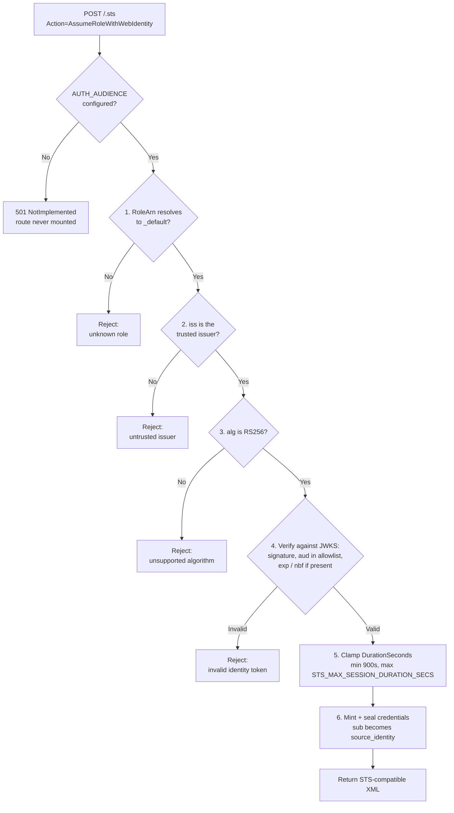

# ADR-004: Inbound Authentication — OIDC Token Exchange at `/.sts`

**Status:** Accepted — implemented
**Date:** 2026-03-14
**RFC:** RFC-001 §7
**Depends on:** ADR-001
**Implementation:** `src/sts.rs`, `src/lib.rs`, `src/config.rs`; `source.coop:src/lib/actions/proxy-credentials.ts`
**Implemented by:** #116 (initial `/.sts` exchange), #163 (multiple accepted audiences), #165 (configurable max session duration), #185 (ARN-shaped `_default` alias), #196 (form-encoded POST bodies, wiring [multistore#112](https://github.com/developmentseed/multistore/pull/112)) · source.coop#283 (OIDC auth), source.coop#391 (in-browser uploads via the proxy), source.coop#402 (mid-upload credential refresh)

---

## Context

ADR-001 establishes that all callers must obtain short-lived SigV4 session credentials before making S3 API calls. This ADR defines how those credentials are obtained: the exchange endpoint, the trust model for incoming identity tokens, and the Role under which credentials are issued.

The industry standard for secretless workload authentication is OIDC workload identity federation: a workload presents a signed JWT issued by its platform's OIDC provider to a Security Token Service, which validates it and returns short-lived scoped credentials.

This ADR covers the exchange mechanism as built: **one trusted issuer, one built-in Role**. Two deliberate extensions are specified separately and are not implemented — accepting tokens from multiple platform issuers (ADR-009) and account-owned Roles with claim constraints and permission ceilings (ADR-010). The endpoint contract below is designed so that both are additive.

---

## Decision

### The `/.sts` Endpoint

```
POST /.sts        (application/x-www-form-urlencoded)
GET  /.sts        (query parameters)
```

Dot-prefixed account names (`.sts`, `.well-known`) are reserved as invalid account slugs, preventing routing conflicts with S3 API paths.

The request and response formats are [AWS STS](https://docs.aws.amazon.com/STS/latest/APIReference/API_AssumeRoleWithWebIdentity.html)-compatible:

```
Action=AssumeRoleWithWebIdentity
&WebIdentityToken=<JWT>
&RoleArn=_default
&RoleSessionName=my-job     (accepted and ignored — see below)
&DurationSeconds=3600
```

```xml
<AssumeRoleWithWebIdentityResponse>
  <AssumeRoleWithWebIdentityResult>
    <Credentials>
      <AccessKeyId>...</AccessKeyId>
      <SecretAccessKey>...</SecretAccessKey>
      <SessionToken>...</SessionToken>
      <Expiration>2026-03-22T13:00:00+00:00</Expiration>
    </Credentials>
    <AssumedRoleUser>
      <AssumedRoleId>_default</AssumedRoleId>
      <Arn>_default</Arn>
    </AssumedRoleUser>
  </AssumeRoleWithWebIdentityResult>
</AssumeRoleWithWebIdentityResponse>
```

Both transports are supported because AWS SDKs send query-protocol operations as a form-encoded POST with no query string at all. The Worker absorbs that form body before routing, or SDK clients would fall through to the S3 pipeline unhandled. This makes `/.sts` a drop-in target for `boto3.client('sts', endpoint_url='https://data.source.coop/.sts')`, and for the SDKs' built-in web-identity credential providers (`AWS_WEB_IDENTITY_TOKEN_FILE` / `AWS_ROLE_ARN`).

**`AssumeRoleWithWebIdentity` is an action parameter, not a path segment.** The route is plain `/.sts`; the action travels in the query string or the form body. Parameters are read from exactly one source — the query string is tried first, then the body — and are **never merged across the two**, matching AWS. Collecting a form-encoded `POST` body never steals a payload the S3 forwarding path needs, because form-encoded `POST` is not part of the S3 protocol. This behaviour is implemented upstream in [multistore#112](https://github.com/developmentseed/multistore/pull/112).

Two caveats on that. Absorption is **conditional**: it requires a form-urlencoded `POST` whose `Content-Length` is present, parseable, and within the size cap — a chunked form POST with no `Content-Length` is streamed through and does fall back to the S3 pipeline. And `RoleSessionName` is **accepted and ignored**: the parser reads only `RoleArn`, `WebIdentityToken`, and `DurationSeconds`, so the value reaches neither the sealed token nor any log. AWS requires callers to send it, so it will be present; it just names nothing here. `AssumedRoleId` and `Arn` in the response are both the literal role id.

### The `_default` Role and its ARN Alias

A single built-in Role, `_default`, is served from a hardcoded registry:

- Trusts exactly one OIDC issuer (`AUTH_ISSUER`)
- No subject conditions — any subject from that issuer may assume it
- Unlimited scope ceiling; the account's own permissions are the sole constraint (see ADR-005)

`RoleArn` is accepted either literally as `_default` or as an ARN-shaped alias whose resource is `role/_default` (e.g. `arn:aws:iam::000000000000:role/_default`, any partition or account ID). The alias exists because AWS SDKs validate `RoleArn` client-side — ARN shape, 20-character minimum — before the request is ever sent, so a bare `_default` cannot reach the server from unmodified tooling. The partition and account portions carry no meaning here and are ignored rather than validated.

### Trust Model — Issuer and Audience

**Issuer.** `AUTH_ISSUER` names the single trusted OIDC issuer: Source Cooperative's Ory-based auth system (`https://auth.source.coop`, or the staging equivalent). A token from any other issuer is rejected before any network call.

**Audience.** `AUTH_AUDIENCE` is a comma-separated allowlist of OAuth client IDs; a token is accepted if its `aud` matches any entry. Production lists the web frontend and `source-coop-cli`.

**The audience restriction is load-bearing and the endpoint fails closed without it.** Without it, an ID token that a user granted to *any* third-party OAuth client registered with the issuer could be exchanged for that user's proxy credentials. When `AUTH_AUDIENCE` is unset the STS route is never mounted and `/.sts` returns `501 NotImplemented`, rather than being served unrestricted.

**Algorithm.** Inbound token verification pins RS256 and rejects any other `alg` before fetching JWKS, closing algorithm-confusion and downgrade attacks.

### Exchange Flow

1. Parse `RoleArn`; resolve it to the `_default` Role or reject
2. Extract `iss` from the JWT without verifying, and reject if it is not the trusted issuer
3. Reject unless `alg` is RS256
4. Fetch the issuer's JWKS (cached) and verify the signature and `aud` against the allowlist, plus `exp` and `nbf` with a 60-second clock-skew tolerance
5. Clamp `DurationSeconds` to `[900, STS_MAX_SESSION_DURATION_SECS]`, defaulting to 3600 when the caller omits it (see ADR-001 — the ceiling is not the default)
6. Mint and seal credentials (ADR-001), carrying the token's `sub` as `source_identity`



> [!WARNING]
> **`exp` is only checked when the claim is present.** Upstream, both time claims are guarded by `if let Some(..)`, so a token carrying no `exp` is accepted and never expires. A missing `aud`, by contrast, is fail-closed. This is harmless with a single trusted issuer that always sets `exp` (Ory does), but it becomes a real exposure the moment ADR-009 admits issuers we do not control — it should be fixed upstream before then.

Steps 2 and 3 reject **before any network call**: the issuer is matched and the algorithm pinned prior to fetching JWKS, so a token from an untrusted issuer costs nothing to refuse.

The Role identifier is required on the request. The system does not scan Roles to find a match — this keeps the lookup O(1) and deterministic, and mirrors AWS's own `AssumeRoleWithWebIdentity`.

### JWKS Caching

The JWKS cache is isolate-shared (a process-wide `OnceLock`, with `Arc<Mutex<_>>` interiors) with a 15-minute TTL, so the TTL is effective across requests within an isolate rather than being rebuilt per request. Different isolates may briefly hold different versions of an issuer's JWKS during key rotation; in practice OIDC providers publish new keys well before retiring old ones.

### Identity Sources in Use

**Interactive web users.** The Next.js application drives an Ory Hydra OAuth2 authorization-code flow server-side — using the admin API to accept the login and consent challenges for an already-authenticated user — to obtain a Hydra-signed OIDC ID token, then exchanges that token at `/.sts` with `RoleArn=_default`. The resulting credentials are used for in-browser uploads directly to the proxy.

> [!IMPORTANT]
> The identity fed into that flow is trusted as-is: the Ory admin API will mint a login for any subject. Callers must pass an identity taken from a verified session, never from request parameters. This is enforced by keeping the function `server-only` and off the Server Action surface.

**CLI.** `source-coop-cli` is a registered audience and exchanges its own Ory token by the same path.

**Anonymous readers.** Anonymous S3 requests are not authenticated at all and perform no exchange; the proxy resolves them against the API's unauthenticated view (see ADR-005).

---

## Consequences

**Benefits**

- AWS STS-compatible request/response format works with unmodified AWS SDKs pointed at a custom endpoint URL.
- All credential paths converge on one endpoint — a single validation and issuance code path.
- No stored secrets for interactive users; the browser never holds a long-lived credential.
- Fail-closed audience handling means a misconfigured deployment refuses service rather than over-issuing.
- The Role identifier is already on the request contract, so account-owned Roles (ADR-010) are an additive change for existing clients.

**Costs / Risks**

- `/.sts` is on the critical path for session establishment; its availability and latency affect all new sessions.
- **Only one issuer is trusted.** CI/CD workflows with ambient OIDC tokens — the RFC's headline use case — cannot exchange at all. See ADR-009.
- **Only one Role exists, with an unlimited ceiling.** There is no way to issue a credential narrower than the account's full permissions. See ADR-010.
- An unavailable JWKS causes all exchanges for that issuer to fail for 30 seconds — failures use their own short negative-cache TTL, not the 15-minute success TTL — after which one retry is attempted. There is no serve-stale path: entries are used only while fresh, so a *stale* JWKS never blocks anything.
- The web flow's dependence on the Ory admin API means a compromised call site is a "become any user" primitive; it is guarded by construction rather than by input validation.
- **`aws-actions/configure-aws-credentials` does not work.** It calls `GetCallerIdentity` after the exchange, which `/.sts` does not implement. The web-identity credential providers built into the SDKs do work; the most popular GitHub Action for this does not. Tracked separately.

---

## Alternatives Considered

**IdP-first resolution (no Role identifier required)** — rejected. Would require scanning all Roles across all accounts to find matches for a given JWT issuer, creating ambiguity when several match. Requiring the caller to name the Role keeps the lookup O(1) and deterministic.

**Rejecting non-ARN `RoleArn` values** — rejected. AWS SDKs validate the ARN shape client-side, so strictness here would break exactly the drop-in SDK compatibility the endpoint exists to provide.

**Accepting any audience from the trusted issuer** — rejected as unsafe, and actively guarded against: an ID token minted for any OAuth client of the issuer would otherwise be exchangeable for that user's credentials.

**RFC 8693 token exchange ("act-as") for server-side requests** — considered. Rejected for the initial implementation: exchanging the user's own token is simpler and achieves the same access-attribution goal. Revisit if audit logs need to distinguish "user accessed directly" from "the web app accessed on the user's behalf".
