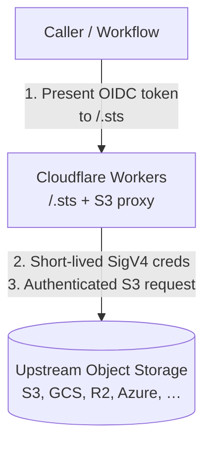
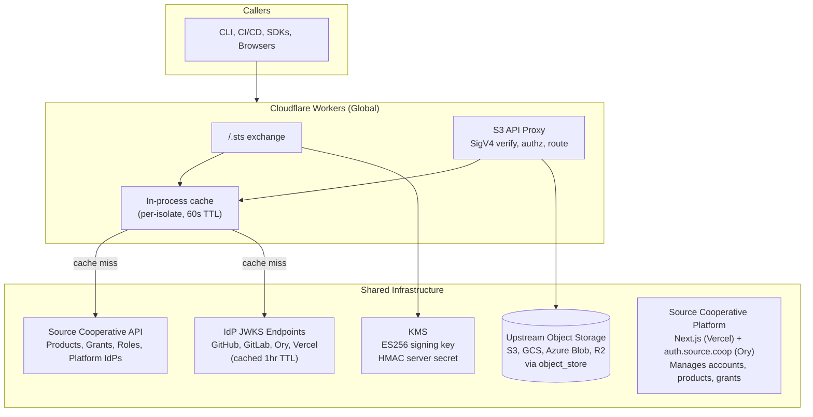

# RFC-001: Source Cooperative Data Proxy Re-Architecture

**Status:** Proposed — Request for Comment
**Date:** 2026-03-14  
**Authors:** @alukach
**Replaces:** Current data proxy (ECS, Rust, long-lived credentials)  

---

## Purpose

This document describes the proposed re-architecture of the Source Cooperative data proxy. It is written to give contributors, maintainers, and stakeholders a complete picture of the system design — including the reasoning behind each major choice — and to invite critique before decisions are ratified. Open questions are explicitly called out throughout.

This is not a final specification. It is the basis for a conversation. Decisions that emerge from review will be captured in individual Architecture Decision Records (ADRs) referenced in the [Decision Index](#decision-index).

---

## Table of Contents

1. [Background](#1-background)
2. [Goals and Non-Goals](#2-goals-and-non-goals)
3. [System Overview](#3-system-overview)
4. [S3 API Compatibility](#4-s3-api-compatibility)
5. [Runtime and Deployment](#5-runtime-and-deployment)
6. [Implementation Language — Rust](#6-implementation-language--rust)
7. [Inbound Authentication](#7-inbound-authentication)
8. [Authorization](#8-authorization)
9. [Outbound Connectivity](#9-outbound-connectivity)
10. [Extensibility — Middleware](#10-extensibility--middleware)
11. [Modular Architecture and Community Reuse](#11-modular-architecture-and-community-reuse)
12. [Configuration and Data Layer](#12-configuration-and-data-layer)
13. [Future Work](#13-future-work)
14. [Decision Index](#14-decision-index)

---

## 1. Background

Source Cooperative is a platform for hosting and distributing geospatial and scientific datasets. The data proxy is the component responsible for serving those datasets to end users and automated systems — translating authenticated requests into reads (and writes) against object storage backends across multiple cloud providers.

### Current System

The current proxy is a Rust service deployed to AWS ECS. It:

- Exposes an S3-compatible API
- Authenticates callers using long-lived static access key / secret key pairs issued per user
- Calls an external REST API (built into the Source Cooperative Next.js frontend) to resolve configuration, which in turn reads from DynamoDB
- Implements per-backend cloud storage adapters manually, mapping each backend client's error surface to internal error types
- Has Source Cooperative's data model and backend structure baked in, with minimal support for external operators or community extension

### Motivation for Re-Architecture

Several pressures have converged to make a re-architecture worthwhile rather than incremental:

- **Credential model:** Long-lived static credentials are a persistent security liability. The industry has largely moved to short-lived, exchanged credentials via OIDC workload identity federation — a pattern that Source Cooperative should both support and exemplify.
- **Global performance:** Users far from `us-west-2` (where most data resides) experience significant latency. Mirroring data to additional regions is cost-prohibitive. A CDN-native deployment can route traffic more efficiently without duplicating storage.
- **Extensibility:** The current proxy is difficult to reuse or extend. The broader community — data providers, researchers, institutions — would benefit from a proxy they could deploy and adapt. This requires a clean separation between the Source Cooperative-specific layer and the general-purpose framework beneath it.
- **Operational scope:** We anticipate supporting data providers who bring their own datasets and infrastructure, using Source Cooperative as a distribution and access-control layer. The current architecture cannot accommodate this model cleanly.

---

## 2. Goals and Non-Goals

### Goals

- Full S3 API compatibility, consumable by existing S3 SDKs and tooling without modification
- Short-lived, scoped credentials only — no long-lived static keys
- A globally distributed deployment model that improves latency for international users without data replication costs
- Support for any standards-compliant OIDC identity provider as an authentication source
- An authorization model expressive enough to support per-dataset, per-user, and per-organisation access control, with extensibility for future rate limiting, metering, and billing
- A modular, trait-based Rust implementation that the community can depend on, extend, and contribute to
- First-class support for data providers hosting their own datasets through Source Cooperative's access control and distribution layer
- Support for all object storage backends provided by the `object_store` crate, including AWS S3, GCS, Azure Blob Storage, Cloudflare R2, and HTTP

### Non-Goals

- Replacing or re-implementing upstream object storage (we proxy to existing cloud storage backends)
- Supporting storage backends not covered by the `object_store` crate in this iteration
- Building a general-purpose CDN or storage product

---

## 3. System Overview

The initial deployment is a single global proxy on Cloudflare Workers:

**Cloudflare Workers (global)**
A WASM-compiled Rust service deployed across Cloudflare's global edge network. Handles all traffic. Requests are routed through the Cloudflare network to upstream object storage, reducing latency for users far from origin storage regions. Suited for read-heavy, latency-sensitive workloads.

The Workers deployment hosts an STS endpoint at `/.sts` for credential exchange.



> [!NOTE]
> **Future extension: Regional ECS deployments.** For high-throughput, in-region workflows — for example, a Databricks cluster in `us-west-2` reading large volumes from S3 in the same region — routing through an edge node adds unnecessary hops and egress fees. Regional ECS deployments running the same Rust core could serve these workloads with lower latency and zero cross-region egress. This introduces open questions around access restriction (ensuring regional proxies only serve in-region consumers), credential interoperability (whether credentials issued by Workers should be valid against regional proxies), and operational overhead (two deployment targets to build, test, and monitor). The shared Rust core and trait-based architecture (§11) are designed to support this without code divergence when the need arises.

---

## 4. S3 API Compatibility

### Why S3

The S3 API has become the de facto standard protocol for object storage access. The ecosystem of compatible tooling is vast: AWS SDKs in every major language, CLI tools (`aws s3`, `rclone`), data frameworks (DuckDB, Polars, PyArrow, fsspec, GDAL/VSI), orchestration systems (Airflow, Dagster, Prefect), and notebook environments all speak S3 natively.

By exposing an S3-compatible surface, Source Cooperative becomes immediately accessible to this entire ecosystem without requiring callers to install or learn Source-specific client libraries. This was true of the current proxy and remains true of the re-architecture.

### Credential Model Change

The standard SigV4 model assumes long-lived static `Access Key ID` / `Secret Access Key` pairs. We are making a deliberate departure: **Source Cooperative will not issue or accept long-lived static credentials.** All SigV4 credentials are temporary session credentials — the same triplet shape (`AccessKeyId`, `SecretAccessKey`, `SessionToken`) that AWS STS issues — with a bounded TTL.

Callers must exchange a trusted identity token for session credentials before making S3 API calls. This is a one-time step per session that all major AWS SDKs support natively via the credential provider chain. For data tooling that accepts credentials via environment variable (`AWS_ACCESS_KEY_ID`, `AWS_SECRET_ACCESS_KEY`, `AWS_SESSION_TOKEN`), the experience is identical to using STS-derived credentials against AWS itself.

This choice is a meaningful friction increase for users accustomed to copying a static key into a config file. That friction is intentional: it pushes users toward credential patterns that are auditable, short-lived, and composable with modern workload identity systems. Documentation and CLI tooling should minimise the practical burden of the exchange step.

### SigV4 Verification and Stateless Session Tokens

Incoming requests carry a SigV4 `Authorization` header. The proxy reconstructs the `SecretAccessKey` by deriving it from the `AccessKeyId` via `HMAC-SHA256(server_secret, AccessKeyId)` — the secret is never embedded in the token itself.

Session tokens are **stateless signed JWTs** using ES256 (asymmetric). The token payload encodes: `account_id`, `role_name`, `access_key_id`, the Role's permission statements (ceiling), `assumed_by` (original IdP subject for audit), `session_name`, and `exp`. The token encodes the Role's permission ceiling but **not** the account's full permission set — account permissions are dynamic and resolved per-request from the configuration layer (see §8). At request time, the effective permission is the intersection of (Role ceiling from token) and (account's actual permissions from policy store).

The proxy validates the JWT signature against its own public key and enforces `exp` and `nbf`. No external database lookup is required to verify the token or reconstruct the signing key — verification is fully stateless.

Short-lived credentials (15 min to 12 hours) bound the exposure window of a compromised token, eliminating the need for per-token revocation in the initial implementation (see ADR-001).

---

## 5. Runtime and Deployment

### Cloudflare Workers

The deployment target is Cloudflare Workers, with the proxy compiled to WebAssembly. This choice is motivated by several properties of the Workers platform:

**Global distribution without operational overhead.**[^1] Workers deploy to Cloudflare's edge network (330+ locations worldwide) automatically. Requests are served from the location closest to the caller, and onward routing to upstream object storage traverses the Cloudflare backbone[^2] rather than the public internet. For users in Europe, Asia-Pacific, or South America accessing data stored in `us-west-2`, this meaningfully reduces latency without requiring us to replicate the underlying data.

**Effectively no cold start.**[^3][^4] Workers use the V8 isolate model rather than container-based execution. Historically, Cloudflare pre-warmed Workers during the TLS handshake of incoming requests — because isolates initialised in single-digit milliseconds, the cold start could be entirely hidden within handshake latency. As Workers have grown to support larger, more complex applications, Cloudflare introduced a "Shard and Conquer" technique using consistent hashing to coalesce traffic onto warm instances, achieving a sustained warm request rate of 99.99%.[^5] In practice, callers should expect effectively zero cold start latency for a proxy workload.

**No Cloudflare-imposed egress fees.** Cloudflare does not charge for bandwidth egress from Workers, regardless of response payload size. Note that egress fees charged by upstream object storage providers (AWS S3, GCS, etc.) still apply — Cloudflare's no-egress policy eliminates the additional layer of transfer charges that would otherwise be imposed by the compute platform itself.

**No wall clock restrictions.** Unlike some serverless platforms, Cloudflare Workers do not impose a wall-clock timeout on in-flight requests. CPU time limits apply per invocation (configurable up to 5 minutes on paid plans), but streaming large objects through the proxy does not risk being killed mid-response due to elapsed time.

**Predictable, low cost.** The Workers paid plan charges $0.30 per million requests and $0.02 per million CPU milliseconds, with a $5/month base subscription that includes 10 million requests and 30 million CPU milliseconds. For a streaming proxy workload with low per-request CPU time, this is highly favourable. There are no additional charges for data transfer through Cloudflare.

**WASM compatibility.** The Workers runtime supports WASM natively. Rust compiles to WASM with mature toolchain support (`wasm-pack`, `worker-rs`), making the Workers target a natural fit for a Rust-implemented proxy.

[^1]: Cloudflare operates a global anycast network across 330+ cities. See [Cloudflare Network](https://www.cloudflare.com/network/).
[^2]: Cloudflare's backbone is a private network interconnecting its data centres, used to route traffic between edge nodes and origin servers without traversing the public internet. See [Cloudflare Network Interconnect](https://www.cloudflare.com/network-interconnect/).
[^3]: Cloudflare blog: [Eliminating Cold Starts with Cloudflare Workers](https://blog.cloudflare.com/eliminating-cold-starts-with-cloudflare-workers/) — describes the original TLS handshake pre-warming technique.
[^4]: Cloudflare Workers docs: [How Workers Works](https://developers.cloudflare.com/workers/reference/how-workers-works/) — isolates start ~100× faster than a Node.js process in a container.
[^5]: Cloudflare blog: [Eliminating Cold Starts 2: Shard and Conquer](https://blog.cloudflare.com/eliminating-cold-starts-2-shard-and-conquer/) — describes the consistent hashing technique that achieves a 99.99% warm request rate.

### Deployment Topology



**Key properties:**

- The Workers deployment hosts the `/.sts` endpoint and S3 proxy on Cloudflare's global edge network.
- Signing key material (ES256 private key, HMAC server secret) is managed via KMS.
- The proxy maintains per-isolate in-process caching. JWKS for platform IdPs is fetched from upstream issuers and cached with a 1-hour TTL (stale-while-revalidate on failure).
- The policy store is the Source Cooperative API, with in-process and distributed caching (Workers KV) to absorb hot-path load.
- The proxy authenticates to upstream storage via OIDC federation (preferred) or stored credentials (fallback). See §9.

---

## 6. Implementation Language — Rust

We are continuing with Rust as the implementation language. The reasoning is as follows:

**WASM maturity.** Rust has the most mature and production-ready toolchain for compiling to WebAssembly of any systems language. The `worker-rs` crate provides idiomatic bindings to the Cloudflare Workers runtime. This is not a bet on an emerging capability — it is a well-trodden path.

**Performance.** Rust's zero-cost abstractions and lack of garbage collection pauses make it well-suited to a proxy that may stream large objects with tight latency requirements. This was already proven by the current proxy.

**Type system and correctness.** The proxy handles authentication tokens, credential issuance, cryptographic signature verification, and access policy evaluation. Rust's type system — and in particular its trait system — makes it practical to encode invariants that would be runtime errors in other languages. This is increasingly valuable in a codebase where AI-assisted development is part of the workflow: a strong type system provides a correctness harness that catches generated code that compiles but violates domain constraints.

**Community familiarity.** The Source Cooperative contributor community has more Rust experience than Go, and more Go experience than C++. Python is more widely known, but is not suitable for the WASM target. Rust is the best fit given the actual pool of contributors.

**Trait-based extensibility.** The Rust trait system is central to the modularity goals described in [Section 11](#11-modular-architecture-and-community-reuse). Traits allow the core proxy framework to define interfaces — for auth, authz, storage backend, middleware, configuration — that downstream users implement without forking the core. This is difficult to achieve cleanly in languages without a comparable abstraction.

---

## 7. Inbound Authentication

### Design Principle

Source Cooperative will not issue or accept long-lived static credentials. All authentication flows terminate in short-lived SigV4 session credentials obtained through a token exchange. The exchange endpoint at `/.sts` acts as a Security Token Service that accepts JWTs from trusted OIDC identity providers and returns temporary credentials scoped by a caller-specified Role.

The key design choice is that **accounts own their Roles**. Each account (Individual or Organization) can create Roles that scope access to their resources, constrained to platform-registered IdPs. This mirrors how AWS IAM allows accounts to configure their own trust policies and roles.

### Identity Providers (IdPs)

IdPs exist at two tiers:

**Platform IdPs** are pre-configured by Source Cooperative operators — well-known OIDC issuers relevant to data engineering workflows (GitHub Actions, GitLab CI, `auth.source.coop`, Vercel, etc.). Platform operators can add new issuers over time without code changes.

> [!NOTE]
> **Future extension: Account-registered IdPs.** The initial implementation supports platform IdPs only. Account-level IdP registration (for corporate Okta, self-hosted Keycloak, etc.) can be added later without changing the Role schema or STS exchange flow. Platform operators can add new well-known issuers at any time without code changes.

### Roles

Roles belong to an account and define two things: **who can assume the Role** (identity constraints binding platform IdPs with claim matching) and **what the Role's credentials can access** (permission statements). Roles are identified by URN: `sc::{account_id}::role/{role_name}`.

A Role acts as a **ceiling** on the account's existing permissions. The credentials issued for a Role can never exceed what the account itself has access to. At request time, the effective permission is the intersection of the Role's permission statements and the account's actual permissions from the policy store.

Every account has a built-in `_default` Role constrained to `auth.source.coop` with an unlimited ceiling — it passes through all of the account's permissions for interactive users.

### STS Token Exchange

The STS endpoint accepts a signed JWT and a Role URN, validates the JWT against the Role's identity constraints, and returns a session credential triplet:

```
POST /.sts/assume-role-with-web-identity
Content-Type: application/x-www-form-urlencoded

Action=AssumeRoleWithWebIdentity&RoleArn=sc::my-org::role/publisher&WebIdentityToken=<JWT>&RoleSessionName=my-job&DurationSeconds=3600
→ XML response (AWS STS-compatible): { AccessKeyId, SecretAccessKey, SessionToken, Expiration }
```

The request and response formats are AWS STS-compatible, enabling `boto3.client('sts', endpoint_url=...).assume_role_with_web_identity(...)`.

The STS exchange flow:
1. Parse the Role URN to extract account and role name
2. Load the Role definition (cached)
3. Match the JWT's `iss` claim against the Role's allowed IdPs — reject if no match
4. Fetch and cache the IdP's JWKS, verify the JWT signature, `exp`, `nbf`, and `aud`
5. Evaluate the Role's claim constraints against the JWT claims
6. Issue a short-lived session token (see §4) containing account identity, Role permissions, and audit context

The Role URN is required — the caller must know which Role to assume. This keeps the lookup path O(1) and deterministic.

### Supported Identity Sources

#### Platform IdPs — CI/CD and Managed Compute

Workflows running in environments that provide ambient OIDC tokens can exchange them directly. These environments require no stored secrets:

| Platform                | OIDC Issuer                                   | Key Claims for Constraints                      |
| ----------------------- | --------------------------------------------- | ----------------------------------------------- |
| Source Cooperative Auth | `auth.source.coop`                            | `sub`, `groups`                                 |
| GitHub Actions          | `https://token.actions.githubusercontent.com` | `repository`, `ref`, `environment`              |
| GitLab CI/CD            | `https://gitlab.com`                          | `project_path`, `ref_type`, `environment`       |
| Azure DevOps            | `https://vstoken.dev.azure.com/<org_id>`      | project, pipeline, environment                  |
| HCP Terraform           | `https://app.terraform.io`                    | `terraform_workspace_id`, `terraform_run_phase` |
| Vercel                  | `https://oidc.vercel.com/<team_slug>`         | `owner`, `project`, `environment`               |

This list is illustrative, not exhaustive. Platform operators can add new issuers over time without code changes.

#### Source Cooperative Auth (`auth.source.coop`)

Users authenticated interactively via Source Cooperative's Ory-based auth system present their Ory token to `/.sts` with their account's `_default` Role. This is appropriate for interactive local development, ad-hoc data access, and CLI tooling.

| Mechanism                           | Suited for             | Stored secret?     | Credential TTL    |
| ----------------------------------- | ---------------------- | ------------------ | ----------------- |
| Ambient OIDC (GitHub, GitLab, etc.) | CI/CD, managed compute | No                 | 15 min – 12 hours |
| `auth.source.coop` / Ory token      | Interactive local dev  | No (session-based) | 15 min – 12 hours |

### Next.js and Front-End Authentication

**Authenticated users:** The browser holds the Ory session token. The client exchanges it with `/.sts` using the user's `_default` Role to obtain short-lived session credentials. S3 API calls are made directly from the browser to the proxy. Access is recorded under the user's own identity.

**Anonymous visitors:** The Next.js server uses its Vercel OIDC token to exchange for credentials via a platform-defined Role scoped to read-only access on public products. All anonymous traffic flows through the proxy's full middleware stack.

**Admin users:** Same flow as authenticated users. Admin capabilities are determined by account permissions in the policy store, not by a special role type.

### CLI and SDK Support

**`source-coop` CLI:** The existing CLI handles authentication and credential management. Users configure `~/.aws/config` with role-specific profiles:

```ini
[profile source-read]
credential_process = source-coop creds --role-arn sc::my-org::role/reader

[profile source-write]
credential_process = source-coop creds --role-arn sc::my-org::role/publisher
```

**GitHub Action:** `source-cooperative/configure-credentials` requests a GitHub OIDC token, calls the STS endpoint, and exports credentials as environment variables.

**Direct SDK usage:** `boto3.client('sts', endpoint_url='https://data.source.coop/.sts').assume_role_with_web_identity(...)` works with Source Cooperative URN format.

---

## 8. Authorization

### Design Principles

Two properties drive the authorization design:

1. **The Role is a ceiling; account permissions are the grants.** The Role's permission statements (embedded in the SessionToken at exchange time) define the maximum scope of access for these credentials. The per-account permission lookup determines what the account can actually access. The proxy enforces the intersection. A Role can narrow access but never widen it beyond what the account has.

2. **Account permissions are dynamic.** A user who joins an organisation or receives a grant on a new dataset should see that change reflected immediately. Because account permissions are resolved per-request from the policy store (not frozen in the token), changes propagate within the cache TTL.

This mirrors how AWS IAM works: the session token asserts role membership with embedded permission boundaries, and the role's current policies are evaluated live on each API call.

### Identity Model

The session token (§4) carries these fields relevant to authorization:

- `account_id` — the account whose permissions form the base grants
- `role_name` — identifies the Role (for logging and ceiling lookup)
- `permissions` — the Role's permission statements, embedded at exchange time (the ceiling)
- `assumed_by` — the original IdP subject (for audit, not authorization)
- `exp` — token expiry; checked before any policy evaluation

### How Roles Replace the Fixed Role Set

**Anonymous access** does not use a Role. Requests without credentials can only read public products.

**Authenticated user access** uses the built-in `_default` Role with unlimited ceiling (`"resources": ["*"]`). The account's actual permissions are the sole constraint.

**Admin access** is determined by account permissions in the policy store, not by a special role type.

**Scoped access** is the new capability. A Role with specific permission statements creates a narrow ceiling that constrains credentials regardless of the account's broader permissions.

### Per-Request Resolution Strategy

Authorization proceeds in steps, with early exits to minimise lookups:

**Step 1 — Identify the caller.** No credentials → anonymous (read-only, public products only). `SCSTS` prefix → STS credential path.

**Step 2 — Role action check (in-memory).** Check the SessionToken's embedded `permissions` array. If the requested action on the requested resource does not match any permission statement, deny immediately. This is a local check — no network call.

**Step 3 — Public resource early exit (cached, 60–300s TTL).** For read requests on public products, permit immediately. No further lookups. This is the fast path for the majority of traffic.

**Step 4 — Account permission lookup (cached, 30–60s TTL).** For non-public resources or write operations: fetch the account's permissions from the policy store. Compute `(Role ceiling) ∩ (account permissions)`. Permit if the intersection covers the requested action and resource; deny otherwise.

### Permission Statement Format

Role permission statements use this structure:

```json
{
  "actions": ["read", "write"],
  "resources": ["sc::my-org::product/climate-data/*"]
}
```

- Actions are `read` (GetObject, HeadObject, ListObjects) and `write` (PutObject, DeleteObject, multipart operations).
- Resources use URN patterns with optional prefix scoping. `*` as the entire resource means "no ceiling."
- Resource patterns can reference any account's products — a Role can delegate access to products the account has access to, even if owned by another account or org. The request-time intersection enforces the real boundary.
- Permission statements are additive (allow-only). No explicit denies.

### Operation-Specific Behaviour

**Single-resource operations (`GetObject`, `PutObject`, `HeadObject`, `DeleteObject`)**
After the Role ceiling check and public early exit, a point lookup: does the account have an access grant for this product? Prefix restrictions from both the Role and the account grant are enforced.

**`ListBuckets`**
The proxy constructs this response from the policy store — the upstream is never called. Anonymous users see public products. STS callers with unlimited ceiling see all products the account has grants for. STS callers with scoped Roles see only the intersection of Role resource patterns and account grants.

**`ListObjects` (within a product)**
After the Role ceiling check, public early exit, and account permission lookup: if the Role includes a key prefix restriction, it is passed as a filter to the upstream `ListObjects` call.

### Cache Strategy

All policy store lookups are cached in-process (per-isolate):

| Lookup                         | Cache Key                  | TTL     |
| ------------------------------ | -------------------------- | ------- |
| Product public flag            | `product_id`               | 60–300s |
| Account permission for product | `(account_id, product_id)` | 30–60s  |
| Account's full product list    | `account_id`               | 5–10s   |

The short TTL on the full product list ensures that account permission changes are reflected within seconds. For Workers, cache is per-isolate and not shared across edge nodes. Workers KV is available as a shared tier if needed.

---

## 9. Outbound Connectivity

### Design Principle

When the proxy receives an authenticated, authorised request, it must retrieve or write the underlying object from an upstream storage backend (S3, GCS, Azure Blob, R2, etc.). This connection to upstream storage must itself be authenticated, without embedding long-lived cloud credentials in the proxy service.

### Current Approach and Its Limitations

The current proxy implements per-backend adapters manually — a separate integration for each cloud storage provider, with bespoke error mapping from each provider's client library to Source Cooperative's internal error types. This is maintenance-intensive and creates an ongoing gap as new backends are added or existing client APIs change.

### `object_store` Adoption

The re-architecture adopts the [`object_store`](https://crates.io/crates/object_store) crate as the unified abstraction layer for upstream storage access. `object_store` provides a single async trait (`ObjectStore`) with implementations for S3, GCS, Azure Blob, R2, HTTP, and local filesystem. By building on this abstraction:

- Backend-specific client code and error mapping is eliminated from the proxy codebase
- New storage backends supported by `object_store` become available to the proxy without proxy changes
- The community can contribute additional `object_store` implementations that the proxy can consume

### Outbound Authentication

Two mechanisms for authenticating to upstream backends are supported:

**OIDC token issuance (preferred)**

Source Cooperative operates as an OIDC identity provider, publishing a discovery document (`/.well-known/openid-configuration`) and JWKS endpoint. Upstream cloud providers (AWS, GCP, Azure) can register Source Cooperative as a trusted external identity provider via their native workload identity federation mechanisms. The proxy then generates short-lived, audience-scoped JWTs and exchanges them for cloud credentials at each provider's STS — no long-lived cloud credentials are stored in the proxy.

This is the preferred model: credentials are ephemeral, the trust relationship is declarative and auditable, and key rotation at the proxy level propagates automatically without reconfiguring upstream providers.

**Stored credential secrets (fallback)**

For upstream providers or storage systems that do not support OIDC workload identity federation, credentials may be stored as encrypted secrets and injected into the proxy's configuration at startup. This is a fallback, not the preferred path, and should be documented as such.

### Data Provider Hosting

Beyond serving Source Cooperative's own managed datasets, the proxy is intended to support **data providers** who bring their own storage infrastructure. In this model, a data provider registers their upstream storage (their own S3 bucket, GCS bucket, etc.) with Source Cooperative, and the proxy serves as an access control, metering, and distribution layer in front of their data.

This model offers data providers:

- **Cost control:** Rate limiting, metering, and access thresholds enforced by the proxy prevent runaway egress or compute costs on the provider's underlying storage
- **Access control:** Fine-grained role and policy configuration determines who can access which datasets under what conditions
- **Exposure:** Data is discoverable and accessible via the Source Cooperative platform and UI, without the provider having to build their own access layer
- **Outbound auth flexibility:** The provider's own cloud credentials (or OIDC trust relationship) are used for the proxy's outbound connection to their storage — the provider retains ownership of their backend

> [!NOTE]
> **TODO:** Define the operational model for data provider onboarding. Clarify how outbound credentials for provider-hosted storage are stored and scoped — whether they are isolated per-provider or share infrastructure with Source Cooperative's own backend credentials. Define the trust boundary: what can Source Cooperative see or access in a provider's backend?

---

## 10. Extensibility — Middleware

### Motivation

A general-purpose data proxy needs to support behaviours beyond simple authentication and object retrieval — access logging, usage analytics, rate limiting, and cost attribution. These cross-cutting concerns are implemented as a composable middleware stack wrapping the core request handler.

### Middleware Stack

Each middleware layer receives the request context (resolved identity, role, resource, action), may short-circuit with a denial, may record an event, and passes the request onward. Middleware components are defined as Rust traits (see §11), making them first-class extension points for community contributions.

> [!NOTE]
> **Future extension: Access logging and analytics.** The middleware architecture is designed to support structured request logging for usage analytics (which products and files are most popular, which accounts drive the most traffic) and cost attribution (distinguishing open data program buckets, Source Cooperative-owned buckets, and third-party provider-hosted buckets). The log backend, schema, storage, and analytics pipeline are significant decisions that will require a dedicated ADR.
>
> **Future extension: Rate limiting, quotas, and billing.** Rate limiting, quota enforcement, billing event emission, and audit logging are deferred until there is concrete demand. Each fits the middleware trait interface and can be added without modifying the core proxy.

---

## 11. Modular Architecture and Community Reuse

### Motivation

The current proxy is tightly coupled to Source Cooperative's specific data model, backend configuration, and operational context. The re-architecture treats Source Cooperative's deployment as *one instance* of a general-purpose S3-compatible data proxy framework. The framework is the primary artefact; Source Cooperative's configuration of that framework is a thin layer on top.

This work builds on [`multistore`](https://github.com/developmentseed/multistore), an early-stage effort to create a composable S3-compatible proxy in Rust.

### Design Approach

The proxy is structured as separate Rust crates to promote composability. Concerns like auth, authorization, storage backend resolution, and middleware are separated behind trait boundaries so that they can be developed, tested, and reused independently. The exact crate boundaries will emerge during implementation — the principle is separation of concerns, not a fixed crate map.

Source Cooperative-specific behaviour (IdP configuration, policy store implementation, deployment configuration) is expressed through the same trait interfaces that any other operator would use. Nothing Source Cooperative-specific lives in the core crates.

> [!NOTE]
> **TODO:** Finalise crate boundaries, naming, licensing, and governance model as the implementation progresses.

---

## 12. Configuration and Data Layer

### Constraint: The Policy Store Is on the Hot Path

The authorization model described in §8 requires the proxy to perform per-request lookups against a policy store for every non-public authenticated request. This is not optional — it is what enables dynamic permissions to reflect changes (new organisations, new dataset grants) in near real-time. Unlike a token-only model (which would freeze permissions at exchange time), this design explicitly trades token self-sufficiency for permission freshness.

This constraint changes the framing of the configuration layer question. The question is no longer *whether* the proxy needs access to a policy store at request time — it does — but rather *how* that access is implemented with acceptable latency and availability.

### Access Patterns

The proxy's access to the configuration layer has two distinct profiles:

**High-frequency, latency-sensitive (per-request)**
- Product public flag lookup — `product_id → {public, backend_config}`
- Account permission lookup — `(account_id, product_id) → {granted, prefix_restrictions}`
- Account product list — `account_id → [product_ids]`

These must complete in single-digit milliseconds. In-process caching (§8) absorbs most of the load; the underlying lookup needs to be fast for cache misses.

**Low-frequency, management (background)**
- Issuer JWKS refresh
- Role definition updates
- Provider credential rotation

These are not on the request hot path and can tolerate higher latency.

### Implementation Approach

The proxy calls the existing Source Cooperative API for all configuration lookups, wrapped in multi-layer caching: in-process (per-isolate) with short TTL, backed by Workers KV as a shared distributed cache tier.

The Next.js application remains the sole schema owner. The proxy does not need direct database credentials. The API enforces schema constraints before data reaches the proxy. This keeps the operational surface small and avoids the schema governance problems that arise when multiple systems access the same database directly.

The REST API is an availability dependency on the hot path for cache misses. In-process caching absorbs the majority of lookups, so the API is only hit on cold starts and TTL expiry. If profiling reveals the API as a latency bottleneck, direct DynamoDB access can be introduced for the highest-frequency lookups (product flags, account grants) while keeping management operations on the API.

### Configuration in Workers

Cloudflare Workers have access to Workers KV (eventually consistent, globally distributed key-value store) and Durable Objects (strongly consistent, single-region). For the Workers deployment, the in-process cache described in §8 is per-isolate and not shared. Workers KV provides a shared distributed cache tier for policy data that survives isolate recycling and is consistent across edge nodes within its eventual-consistency window (typically seconds).

For access control decisions, eventual consistency is generally acceptable — a grant that was created 2 seconds ago but not yet visible in KV is a minor inconvenience, not a security failure.

> [!NOTE]
> **TODO:** Design the full caching stack for the Workers deployment: in-process TTLs, Workers KV usage for shared policy cache, and the propagation path from the authoritative policy store to the edge. Specify which lookups require Workers KV vs. in-process only, and define the cache warming strategy for cold isolate starts.

---

## 13. Future Work

The following areas are acknowledged as future work. Each is designed to be additive — the initial architecture supports them without breaking changes. Details are captured as future extension notes in the relevant ADRs.

- **Access logging, analytics, and cost attribution** — the middleware architecture (§10) supports structured request logging, but the log backend, schema, storage, and analytics pipeline warrant a dedicated ADR (ADR-007)
- **Rate limiting, quota enforcement, and billing** — deferred until there is concrete demand (ADR-007)
- **Regional ECS deployments** — for high-throughput, in-region workflows where edge routing adds unnecessary hops and egress fees (ADR-002)
- **Account-registered IdPs** — allowing accounts to register corporate OIDC issuers (Okta, Keycloak) without operator intervention (ADR-004)
- **Permanent API keys** — long-lived credentials exchangeable for temporary STS credentials, for environments without OIDC support (ADR-001, ADR-005)

---

## 14. Decision Index

The following ADRs will be produced as decisions are ratified through this RFC process. Links will be added as documents are published.

| ADR     | Decision                                                                        |
| ------- | ------------------------------------------------------------------------------- |
| ADR-001 | S3 API compatibility and temporary-credentials-only model                       |
| ADR-002 | Runtime: Cloudflare Workers                                                     |
| ADR-003 | Rust as implementation language                                                 |
| ADR-004 | Inbound authentication — OIDC federation, platform IdPs and account-owned Roles |
| ADR-005 | Authorization model — Role ceiling with dynamic account permission resolution   |
| ADR-006 | Outbound connectivity — OIDC issuer model, `object_store` adoption              |
| ADR-007 | Middleware architecture                                                         |
| ADR-008 | Modular crate architecture and community reuse model                            |
| ADR-009 | Configuration layer — policy store implementation and caching strategy          |

---

*This RFC is open for comment. Please raise questions, objections, and alternative proposals against the open questions in Section 13 and the design decisions throughout. The goal is collective understanding and buy-in before implementation begins.*
