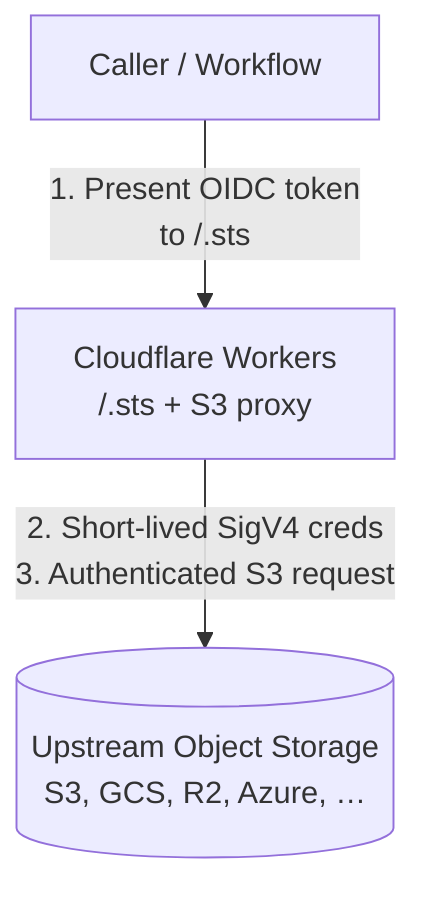
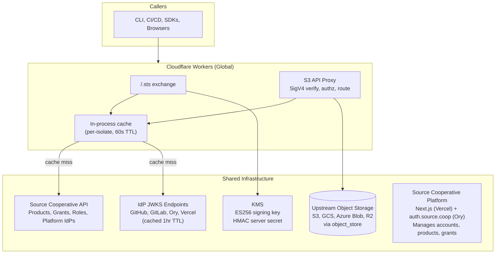

# RFC-001: Source Cooperative Data Proxy Re-Architecture

**Date:** 2026-03-14  
**Authors:** @alukach  
**Replaces:** Current data proxy (ECS, Rust, long-lived credentials)  
**Language:** ASD-STE100 Simplified Technical English  

---

## Purpose

This document describes the new architecture of the Source Cooperative data proxy. It gives contributors, maintainers, and stakeholders a full picture of the system design. It also gives the reason for each important choice. We ask for your comments before we agree to the decisions. This document shows all the open questions.

This document is not a final specification. It is the start of a discussion. We record each agreed decision in an Architecture Decision Record (ADR). The [Decision Index](#13-decision-index) lists these ADRs.

---

## Table of Contents

1. [Background](#1-background)
2. [Goals and Non-Goals](#2-goals-and-non-goals)
3. [System Overview](#3-system-overview)
4. [S3 API Compatibility](#4-s3-api-compatibility)
5. [Runtime and Deployment](#5-runtime-and-deployment)
6. [Implementation Language — Rust](#6-implementation-language--rust)
7. [Inbound Authentication](#7-inbound-authentication)
8. [Authorization](#8-authorization)
9. [Outbound Connectivity](#9-outbound-connectivity)
10. [Multistore — Open-Source Proxy Framework](#10-multistore--open-source-proxy-framework)
11. [Configuration and Data Layer](#11-configuration-and-data-layer)
12. [Future Work](#12-future-work)
13. [Decision Index](#13-decision-index)

---

## 1. Background

Source Cooperative is a platform that keeps and distributes geospatial and scientific datasets. The data proxy sends those datasets to users and to automated systems. The proxy changes authenticated requests into reads and writes on object storage backends. These backends are on more than one cloud provider.

### Current System

The current proxy is a Rust service on AWS ECS. The current proxy does these functions:

- It gives an S3-compatible API.
- It authenticates callers with long-lived static access key and secret key pairs. The system gives one pair to each user.
- It calls an external REST API to get its configuration. This API is a part of the Source Cooperative Next.js frontend, and reads from DynamoDB.
- It contains one manually written storage adapter for each cloud backend. Each adapter maps the errors of one backend client to the internal error types.
- It contains the Source Cooperative data model and backend structure in its code. Thus it gives only minimal support to external operators and to community extensions.

### Reasons for the New Architecture

Four pressures make a new architecture better than more small changes:

- **Credential model:** Long-lived static credentials are a continuous security risk. The industry now uses short-lived credentials from OIDC workload identity federation. Source Cooperative must support this pattern and be an example of it.
- **Global performance:** Users far from `us-west-2` get high latency, because most data is in that region. To copy the data into more regions costs too much. A CDN-native deployment routes the traffic more efficiently and does not copy the data.
- **Extensibility:** It is difficult to use the current proxy again or to extend it. Data providers, researchers, and institutions want a proxy that they can deploy and adapt. Thus the Source Cooperative layer must be separate from the general-purpose framework below it.
- **Operational scope:** Some data providers will bring their own datasets and infrastructure. They will use Source Cooperative as a layer for distribution and access control. The current architecture cannot accommodate this model.

---

## 2. Goals and Non-Goals

### Goals

- Full S3 API compatibility. Existing S3 SDKs and tools can use the proxy without changes.
- Short-lived, scoped credentials only. The system issues no long-lived static keys.
- A global deployment model. It decreases the latency for international users and does not copy the data.
- Support for each OIDC identity provider that obeys the standard.
- An authorization model that controls access for each dataset, each user, and each organisation. The model can be extended later for rate limits, metering, and billing.
- A modular Rust implementation on multistore. The community can use it, extend it, and contribute to it.
- Full support for data providers who keep their own datasets, but who use the access control and distribution layer of Source Cooperative.
- Support for all object storage backends of the `object_store` crate. These backends include AWS S3, GCS, Azure Blob Storage, Cloudflare R2, and HTTP.

### Non-Goals

- To replace or write again the upstream object storage. The proxy sends the requests to the existing cloud storage backends.
- To support storage backends that the `object_store` crate does not support. This is not a goal of this iteration.
- To build a general-purpose CDN or a storage product.

---

## 3. System Overview

The first deployment is one global proxy on Cloudflare Workers.

**Cloudflare Workers (global)**
This is a Rust service that compiles to WASM. Cloudflare deploys the service to its global edge network, where the service receives all of the traffic. The Cloudflare network routes each request to the upstream object storage. Thus the latency decreases for users far from the storage regions. This deployment is applicable to workloads that read frequently and that are sensitive to latency.

The Workers deployment also gives an endpoint at `/.sts`. This endpoint supplies short-lived credentials through a token exchange.


```mermaid
flowchart TD
    Caller["Caller / Workflow"]

    Caller -- "1. Present OIDC token<br />to /.sts" --> Workers

    Workers["Cloudflare Workers<br />/.sts + S3 proxy"]

    Workers -- "2. Short-lived SigV4 creds<br />3. Authenticated S3 request" --> Storage

    Storage[("Upstream Object Storage<br />S3, GCS, R2, Azure, …")]
```

> [!NOTE]
> **Future extension: Regional ECS deployments.** Some workflows have a high throughput and operate in one region. For example, a Databricks cluster in `us-west-2` reads large volumes from S3 in the same region. For these workflows, an edge node adds unwanted hops and egress fees. A regional ECS deployment with the same Rust core can serve these workloads with less latency and no cross-region egress. This extension has three open questions. First, how do we make sure that a regional proxy serves only the consumers in its region? Second, are the credentials from the Workers deployment valid at a regional proxy? Third, how much more operational work do two deployment targets cause? The shared Rust core can support a second target with no divergence of the code.

---

## 4. S3 API Compatibility

### Why We Use S3

The S3 API is now the standard protocol for access to object storage. Many tools speak S3:

- The AWS SDKs, in each important language
- CLI tools: `aws s3` and `rclone`
- Data frameworks: DuckDB, Polars, PyArrow, fsspec, and GDAL/VSI
- Orchestration systems: Airflow, Dagster, and Prefect
- Notebook environments

An S3-compatible surface makes Source Cooperative immediately available to all of these tools. Callers do not install or learn a Source Cooperative client library. This was true of the current proxy, and it stays true in the new architecture.

### Change to the Credential Model

The standard SigV4 model uses long-lived static `Access Key ID` and `Secret Access Key` pairs. We make a deliberate change: **Source Cooperative does not issue or accept long-lived static credentials.** All SigV4 credentials are temporary session credentials with a limited TTL. They have the same shape as the credentials from AWS STS: `AccessKeyId`, `SecretAccessKey`, and `SessionToken`.

Each caller exchanges a trusted identity token for session credentials before the caller sends S3 API calls. This is one step for each session. All important AWS SDKs do this step in their credential provider chain. Many data tools read the credentials from the environment variables `AWS_ACCESS_KEY_ID`, `AWS_SECRET_ACCESS_KEY`, and `AWS_SESSION_TOKEN`. For these tools, the procedure is the same as for STS credentials from AWS.

This change adds work for users who usually copy a static key into a configuration file. The added work is deliberate. It moves users to credential patterns that are auditable, short-lived, and compatible with modern workload identity systems. Documentation and CLI tools must keep the exchange step as easy as possible.

### SigV4 Verification and Stateless Session Tokens

Each incoming request has a SigV4 `Authorization` header. The proxy calculates the `SecretAccessKey` from the `AccessKeyId` with `HMAC-SHA256(server_secret, AccessKeyId)`. The secret is not in the token.

Session tokens are **stateless signed JWTs** that use ES256 (asymmetric). The payload of the token contains these fields: `account_id`, `role_name`, `access_key_id`, the permission statements of the Role (the ceiling), `assumed_by` (the original IdP subject, for audit), `session_name`, and `exp`. The token contains the permission ceiling of the Role, but **not** the full permission set of the account. Account permissions are dynamic, and the proxy gets them from the configuration layer for each request (refer to §8). For each request, the effective permission is the intersection of two sets: the Role ceiling from the token, and the account permissions from the policy store.

The proxy checks the JWT signature against its own public key. It also checks `exp` and `nbf`. The proxy does not use an external database to check the token or to calculate the signing key. Verification is fully stateless.

Short-lived credentials (15 minutes to 12 hours) limit the exposure of a compromised token. Thus the first implementation does not need revocation for each token (refer to ADR-001).

---

## 5. Runtime and Deployment

### Cloudflare Workers

The deployment target is Cloudflare Workers. The proxy compiles to WebAssembly. Seven properties of the Workers platform give the reason for this choice.

**Global distribution with no operational work.**[^1] Cloudflare deploys Workers automatically to its edge network of more than 330 locations. The network serves each request from the location nearest to the caller. Traffic to the upstream object storage goes across the Cloudflare backbone[^2] and not across the public internet. Users in Europe, Asia-Pacific, or South America read data in `us-west-2` with much less latency. We do not copy the data to do this.

**Almost no cold start.**[^3][^4] Workers use the V8 isolate model and not containers. In the past, Cloudflare started a Worker during the TLS handshake of the incoming request. An isolate starts in a few milliseconds, thus the handshake fully hid the cold start. Workers now support larger and more complex applications. Therefore Cloudflare added the "Shard and Conquer" technique. This technique uses consistent hashing to collect the traffic onto warm instances, and it keeps 99.99% of the requests warm.[^5] Thus a caller can expect almost no cold-start latency from a proxy workload.

**No egress fees from Cloudflare.** Cloudflare does not charge for bandwidth out of Workers, and the size of the response makes no difference. The upstream object storage providers (AWS S3, GCS, and others) continue to charge their own egress fees. But the compute platform adds no second layer of transfer charges.

**No wall-clock limit.** Some serverless platforms stop a request after a given time. Cloudflare Workers do not. A CPU-time limit applies to each invocation, and paid plans permit up to 5 minutes. Thus the platform does not stop a large object in the middle of the response because too much time went by.

**Low and predictable cost.** The Workers paid plan costs $0.30 for each million requests and $0.02 for each million CPU milliseconds. The base subscription costs $5 each month and includes 10 million requests and 30 million CPU milliseconds. A streaming proxy uses little CPU time for each request, thus this cost is very good. Cloudflare adds no charge for the data that goes through it.

**WASM compatibility.** The Workers runtime supports WASM directly. Rust compiles to WASM, and the toolchain (`wasm-pack`, `worker-rs`) is mature. Thus Workers are a good target for a proxy in Rust.

**Zero-copy streams.** Multistore does not change the request and response bodies. Each runtime specifies its own body type. In the Workers runtime, a body stays a `web_sys::ReadableStream`. Thus data moves between the caller and the upstream storage with no conversion into Rust types and with no movement across the WASM CPU boundary. This is necessary to stay in the CPU-time limit of Workers when the proxy transfers large objects.

[^1]: Cloudflare operates a global anycast network in more than 330 cities. Refer to [Cloudflare Network](https://www.cloudflare.com/network/).
[^2]: The Cloudflare backbone is a private network between the Cloudflare data centres. It routes traffic between edge nodes and origin servers and does not use the public internet. Refer to [Cloudflare Network Interconnect](https://www.cloudflare.com/network-interconnect/).
[^3]: Cloudflare blog: [Eliminating Cold Starts with Cloudflare Workers](https://blog.cloudflare.com/eliminating-cold-starts-with-cloudflare-workers/). This article describes the first technique, which started the Worker during the TLS handshake.
[^4]: Cloudflare Workers documentation: [How Workers Works](https://developers.cloudflare.com/workers/reference/how-workers-works/). An isolate starts approximately 100 times more quickly than a Node.js process in a container.
[^5]: Cloudflare blog: [Eliminating Cold Starts 2: Shard and Conquer](https://blog.cloudflare.com/eliminating-cold-starts-2-shard-and-conquer/). This article describes the consistent hashing technique that keeps 99.99% of the requests warm.

### Deployment Topology


```mermaid
flowchart TD
    subgraph Callers
        CLI["CLI, CI/CD, SDKs, Browsers"]
    end

    subgraph Workers["Cloudflare Workers (Global)"]
        W_STS["/.sts exchange"]
        W_Proxy["S3 API Proxy<br />SigV4 verify, authz, route"]
        W_Cache["In-process cache<br />(per-isolate, 60s TTL)"]
        W_STS --> W_Cache
        W_Proxy --> W_Cache
    end

    subgraph Shared["Shared Infrastructure"]
        API["Source Cooperative API<br />Products, Grants, Roles, Platform IdPs"]
        KMS["KMS<br />ES256 signing key<br />HMAC server secret"]
        JWKS["IdP JWKS Endpoints<br />GitHub, GitLab, Ory, Vercel<br />(cached 1hr TTL)"]
        Storage[("Upstream Object Storage<br />S3, GCS, Azure Blob, R2<br />via object_store")]
        Platform["Source Cooperative Platform<br />Next.js (Vercel) + auth.source.coop (Ory)<br />Manages accounts, products, grants"]
    end

    CLI --> Workers

    W_Cache -- cache miss --> API
    W_Cache -- cache miss --> JWKS

    W_STS --> KMS

    W_Proxy --> Storage
```

**Primary properties:**

- The Workers deployment contains the `/.sts` endpoint and the S3 proxy. Both operate on the global edge network of Cloudflare.
- KMS holds the key material for signatures: the ES256 private key and the HMAC server secret.
- Each isolate of the proxy keeps an in-process cache. The proxy gets the JWKS of each platform IdP from the upstream issuer and caches it for 1 hour. If a refresh fails, the proxy uses the stale copy.
- The policy store is the Source Cooperative API. In-process caches and a distributed cache (Workers KV) absorb the load on the hot path.
- The proxy authenticates to the upstream storage with OIDC federation. If a backend does not support OIDC, the proxy uses stored credentials. Refer to §9.

---

## 6. Implementation Language — Rust

We continue to use Rust as the implementation language, for five reasons.

**WASM maturity.** Of all systems languages, Rust has the most mature toolchain for compilation to WebAssembly. The `worker-rs` crate gives idiomatic bindings to the Cloudflare Workers runtime. This is a known path, and not a bet on a new capability.

**Performance.** Rust has zero-cost abstractions and no garbage collection pauses. Thus Rust is applicable to a proxy that transfers large objects and has tight latency limits. The current proxy already showed this.

**Type system and correctness.** The proxy operates on authentication tokens, credential issue, cryptographic signatures, and access policies. The type system of Rust, and specially its trait system, can hold invariants that other languages can only check at runtime. This is more and more important in a codebase where AI helps to write the code. A strong type system finds generated code that compiles but that breaks the domain constraints.

**Community knowledge.** The contributors to Source Cooperative know Rust better than Go, and Go better than C++. More people know Python, but Python is not applicable to the WASM target. Thus Rust is the best fit for the actual group of contributors.

**Extensibility through traits.** The trait system of Rust is the basis of the modular design in [Section 10](#10-multistore--open-source-proxy-framework). Traits let the core framework specify interfaces for authentication, authorization, storage backends, middleware, and configuration. Downstream users then write their own implementations and do not fork the core. This is difficult in a language that has no equivalent abstraction.

---

## 7. Inbound Authentication

### Design Principle

Source Cooperative does not issue or accept long-lived static credentials. Each authentication flow ends with short-lived SigV4 session credentials from a token exchange. The exchange endpoint `/.sts` is a Security Token Service. It accepts JWTs from trusted OIDC identity providers, and it returns temporary credentials with the scope of a Role that the caller specifies.

The primary design choice is that **each account owns its Roles**. Each account (an Individual or an Organization) can make Roles that limit the access to its resources. These Roles refer only to platform IdPs. AWS IAM uses the same model: an account configures its own trust policies and roles.

### Identity Providers (IdPs)

There are two tiers of IdPs.

**Platform IdPs** are the IdPs that the Source Cooperative operators configure. They are the well-known OIDC issuers of data engineering workflows: GitHub Actions, GitLab CI, `auth.source.coop`, Vercel, and others. The platform operators can add a new issuer at any time, and they do not change the code.

> [!NOTE]
> **Future extension: Account-registered IdPs.** The first implementation supports platform IdPs only. We can add IdP registration at the account level later, for corporate Okta, a local Keycloak, or an equivalent system. This addition changes neither the Role schema nor the STS exchange flow. Before then, the platform operators can add a new well-known issuer at any time, and they do not change the code.

### Roles

A Role belongs to an account and specifies two things. First, **who can assume the Role**: the identity constraints that bind platform IdPs to claim matches. Second, **what the credentials of the Role can access**: the permission statements. A URN identifies each Role: `sc::{account_id}::role/{role_name}`.

A Role is a **ceiling** on the permissions that the account already has. The credentials of a Role can never be larger than the access of the account. For each request, the effective permission is the intersection of two sets: the permission statements of the Role, and the account permissions from the policy store.

Each account has a built-in `_default` Role. This Role refers only to `auth.source.coop` and has an unlimited ceiling. Thus it passes through all of the permissions of the account, for interactive users.

### STS Token Exchange

The STS endpoint accepts a signed JWT and a Role URN. It checks the JWT against the identity constraints of the Role. It then returns three session credentials:

```
POST /.sts/assume-role-with-web-identity
Content-Type: application/x-www-form-urlencoded

Action=AssumeRoleWithWebIdentity&RoleArn=sc::my-org::role/publisher&WebIdentityToken=<JWT>&RoleSessionName=my-job&DurationSeconds=3600
→ XML response (AWS STS-compatible): { AccessKeyId, SecretAccessKey, SessionToken, Expiration }
```

The formats of the request and the response are compatible with AWS STS. Thus `boto3.client('sts', endpoint_url=...).assume_role_with_web_identity(...)` operates correctly.

The STS exchange has these steps:
1. Read the account and the role name from the Role URN.
2. Load the Role definition from the cache.
3. Compare the `iss` claim of the JWT with the permitted IdPs of the Role. If no IdP agrees, refuse the request.
4. Get the JWKS of the IdP and cache it. Then check the JWT signature, `exp`, `nbf`, and `aud`.
5. Evaluate the claim constraints of the Role against the claims of the JWT.
6. Issue a short-lived session token (refer to §4). The token contains the account identity, the Role permissions, and the audit context.

The Role URN is mandatory, thus the caller must know which Role to assume. This keeps the lookup at O(1) and makes it deterministic.

### Supported Identity Sources

#### Platform IdPs — CI/CD and Managed Compute

Some environments give an OIDC token to each workload. A workflow in such an environment exchanges that token directly and keeps no secret.

| Platform                | OIDC Issuer                                   | Key Claims for Constraints                      |
| ----------------------- | --------------------------------------------- | ----------------------------------------------- |
| Source Cooperative Auth | `auth.source.coop`                            | `sub`, `groups`                                 |
| GitHub Actions          | `https://token.actions.githubusercontent.com` | `repository`, `ref`, `environment`              |
| GitLab CI/CD            | `https://gitlab.com`                          | `project_path`, `ref_type`, `environment`       |
| Azure DevOps            | `https://vstoken.dev.azure.com/<org_id>`      | project, pipeline, environment                  |
| HCP Terraform           | `https://app.terraform.io`                    | `terraform_workspace_id`, `terraform_run_phase` |
| Vercel                  | `https://oidc.vercel.com/<team_slug>`         | `owner`, `project`, `environment`               |

This table gives examples. It is not a full list. The platform operators can add a new issuer at any time, and they do not change the code.

#### Source Cooperative Auth (`auth.source.coop`)

Some users authenticate interactively with the Ory-based auth system of Source Cooperative. Such a user sends the Ory token to `/.sts` with the `_default` Role of the account. This path is applicable to interactive local development, occasional data access, and CLI tools.

| Mechanism                           | Applicable to          | Stored secret?     | Credential TTL    |
| ----------------------------------- | ---------------------- | ------------------ | ----------------- |
| Ambient OIDC (GitHub, GitLab, etc.) | CI/CD, managed compute | No                 | 15 min – 12 hours |
| `auth.source.coop` / Ory token      | Interactive local dev  | No (session-based) | 15 min – 12 hours |

### Next.js and Front-End Authentication

**Authenticated users:** The browser holds the Ory session token. The client sends the token to `/.sts` with the `_default` Role of the user and gets short-lived session credentials. The browser then sends the S3 API calls directly to the proxy. The system records the access against the identity of that user.

**Anonymous visitors:** The Next.js server uses its Vercel OIDC token to get credentials. It uses a Role that the platform specifies, and that Role permits read-only access to public products. All anonymous traffic goes through the full middleware stack of the proxy.

**Admin users:** Admin users use the same flow as authenticated users. The account permissions in the policy store give the admin capabilities. There is no special role type.

### CLI and SDK Support

**`source-coop` CLI:** The existing CLI does the authentication and holds the credentials. A user puts one profile for each role in `~/.aws/config`:

```ini
[profile source-read]
credential_process = source-coop creds --role-arn sc::my-org::role/reader

[profile source-write]
credential_process = source-coop creds --role-arn sc::my-org::role/publisher
```

**GitHub Action:** The `source-cooperative/configure-credentials` action gets a GitHub OIDC token, calls the STS endpoint, and writes the credentials into the environment variables.

**Direct SDK usage:** `boto3.client('sts', endpoint_url='https://data.source.coop/.sts').assume_role_with_web_identity(...)` accepts the URN format of Source Cooperative.

---

## 8. Authorization

### Design Principles

Two properties control the design of the authorization.

1. **The Role is a ceiling, and the account permissions are the grants.** The permission statements of the Role are in the SessionToken from the exchange. They specify the maximum access of these credentials. The lookup of the account permissions specifies the actual access of the account. The proxy applies the intersection of the two. Thus a Role can decrease the access, but it can never increase it.

2. **Account permissions are dynamic.** A user can become a member of an organisation or get a grant on a new dataset. That user must see the change immediately. The proxy gets the account permissions from the policy store for each request and does not freeze them in the token. Thus a change becomes effective in one cache TTL.

AWS IAM operates in the same way. The session token asserts the role membership with an embedded permission boundary, and AWS evaluates the current policies of the role at each API call.

### Identity Model

The session token (§4) contains these fields for the authorization:

- `account_id` — the account whose permissions are the base grants
- `role_name` — the identifier of the Role, for logs and for the ceiling lookup
- `permissions` — the permission statements of the Role from the exchange (the ceiling)
- `assumed_by` — the original IdP subject, for audit and not for authorization
- `exp` — the expiry of the token. The proxy checks it before it evaluates any policy.

### How Roles Replace the Fixed Role Set

**Anonymous access** uses no Role. A request with no credentials can read only public products.

**Authenticated user access** uses the built-in `_default` Role, which has an unlimited ceiling (`"resources": ["*"]`). Thus the actual permissions of the account are the only limit.

**Admin access** comes from the account permissions in the policy store. There is no special role type.

**Scoped access** is the new capability. A Role with specific permission statements makes a small ceiling. That ceiling limits the credentials, and the larger permissions of the account make no difference.

### Resolution Strategy for Each Request

The authorization has four steps. Each step can permit or refuse the request immediately, to keep the number of lookups small.

**Step 1 — Identify the caller.** If there are no credentials, the caller is anonymous and can read only public products. If the credentials have the `SCSTS` prefix, the caller uses the STS path.

**Step 2 — Role action check (in memory).** Look in the `permissions` array of the SessionToken. If no permission statement agrees with the requested action and the requested resource, refuse the request immediately. This check is local and uses no network call.

**Step 3 — Early exit for public resources (cached, 60–300 s TTL).** If the request reads a public product, permit it immediately and do no more lookups. This is the fast path for most of the traffic.

**Step 4 — Account permission lookup (cached, 30–60 s TTL).** For a resource that is not public, or for a write operation, get the account permissions from the policy store. Then calculate `(Role ceiling) ∩ (account permissions)`. Permit the request if the intersection contains the requested action and resource. If it does not, refuse the request.

### Format of a Permission Statement

The permission statements of a Role have this structure:

```json
{
  "actions": ["read", "write"],
  "resources": ["sc::my-org::product/climate-data/*"]
}
```

- The actions are `read` (GetObject, HeadObject, ListObjects) and `write` (PutObject, DeleteObject, and the multipart operations).
- A resource is a URN pattern and can contain a prefix. A resource of `*` means that there is no ceiling.
- A resource pattern can refer to the products of any account. Thus a Role can delegate access to a product of a different account or organisation. The intersection at request time applies the true boundary.
- Permission statements are additive and permit only. There are no explicit denials.

### Behaviour of Each Operation

**Operations on one resource (`GetObject`, `PutObject`, `HeadObject`, `DeleteObject`)**
After the Role ceiling check and the early exit for public products, the proxy does one lookup: has the account a grant for this product? The proxy applies the prefix limits of the Role and of the account grant.

**`ListBuckets`**
The proxy makes this response from the policy store and does not call the upstream storage. An anonymous caller sees the public products. An STS caller with an unlimited ceiling sees all products for which the account has a grant. An STS caller with a scoped Role sees only the intersection of the Role resource patterns and the account grants.

**`ListObjects` (in one product)**
The proxy does the Role ceiling check, the early exit for public products, and the account permission lookup. If the Role has a key prefix limit, the proxy sends that prefix as a filter to the upstream `ListObjects` call.

### Cache Strategy

The proxy caches each lookup of the policy store in its own process (one cache for each isolate).

| Lookup                         | Cache Key                  | TTL     |
| ------------------------------ | -------------------------- | ------- |
| Product public flag            | `product_id`               | 60–300s |
| Account permission for product | `(account_id, product_id)` | 30–60s  |
| Account's full product list    | `account_id`               | 5–10s   |

The short TTL of the full product list makes each change to the account permissions visible in a few seconds. In Workers, the cache belongs to one isolate and the edge nodes do not share it. Workers KV is available as a shared tier if it becomes necessary.

---

## 9. Outbound Connectivity

### Design Principle

The proxy receives a request that is authenticated and authorised. The proxy must then read or write the object in an upstream storage backend such as S3, GCS, Azure Blob, or R2. This connection to the upstream storage must also be authenticated. But the proxy service must contain no long-lived cloud credentials.

### The Current Approach and Its Limits

The current proxy contains one manually written adapter for each cloud storage provider. Each adapter maps the errors of one client library to the internal error types of Source Cooperative. This needs much maintenance. It also causes a continuous gap when we add a new backend or when a client API changes.

### Adoption of `object_store`

The new architecture uses the [`object_store`](https://crates.io/crates/object_store) crate as one abstraction layer for the upstream storage. `object_store` gives one async trait (`ObjectStore`), with implementations for S3, GCS, Azure Blob, R2, HTTP, and the local file system. This abstraction gives three results:

- The proxy codebase contains no backend-specific client code and no error mapping.
- Each new backend of `object_store` becomes available to the proxy with no change to the proxy.
- The community can write more `object_store` implementations, and the proxy can use them.

### Outbound Authentication

The proxy supports two mechanisms to authenticate to an upstream backend.

**OIDC tokens (preferred)**

Source Cooperative operates as an OIDC identity provider. It publishes a discovery document (`/.well-known/openid-configuration`) and a JWKS endpoint. An upstream cloud provider (AWS, GCP, or Azure) can then register Source Cooperative as a trusted external identity provider in its own workload identity federation. The proxy makes a short-lived JWT with a specific audience and exchanges it for cloud credentials at the STS of that provider. Thus the proxy holds no long-lived cloud credentials.

This is the preferred model. The credentials are temporary, the trust relation is declarative and auditable, and a key rotation at the proxy applies automatically. The upstream provider does not change its configuration.

**Stored credential secrets (fallback)**

Some upstream providers and storage systems do not support OIDC workload identity federation. For these, we keep the credentials as encrypted secrets and put them into the configuration of the proxy at start-up. This is a fallback and not the preferred path, and the documentation must say so.

### Hosting for Data Providers

The proxy serves the datasets of Source Cooperative. It also serves the datasets of **data providers** who bring their own storage infrastructure. A data provider registers its upstream storage (its own S3 bucket, GCS bucket, or equivalent) with Source Cooperative. The proxy then operates as a layer for access control, metering, and distribution in front of that data.

This model gives the data provider four benefits:

- **Cost control:** The proxy applies rate limits, metering, and access thresholds. Thus the egress and compute costs of the storage of the provider stay in control.
- **Access control:** The role and policy configuration specifies who can access which dataset, and in which conditions.
- **Exposure:** Users find the data and get it through the Source Cooperative platform and UI. The provider does not build an access layer.
- **Flexible outbound authentication:** The proxy uses the cloud credentials of the provider, or an OIDC trust relation with the provider. Thus the provider keeps the ownership of its backend.

> [!NOTE]
> **TODO:** Specify the operational model to onboard a data provider. Specify how we keep and scope the outbound credentials for the storage of a provider. Are they separate for each provider, or do they share the infrastructure of the Source Cooperative backend credentials? Specify the trust boundary: what can Source Cooperative see or access in the backend of a provider?

---

## 10. Multistore — Open-Source Proxy Framework

The proxy uses [`multistore`](https://github.com/developmentseed/multistore). Multistore is an open-source and composable S3-compatible proxy framework in Rust. It gives the core mechanics of a proxy: request routes, SigV4 verification, storage backend resolution with `object_store`, and extension points for authentication, authorization, and middleware.

The deployment of Source Cooperative is one instance of multistore. The proxy uses the extension points of multistore for its own needs: the OIDC STS exchange (§7), the Role-ceiling authorization with dynamic account permissions (§8), and the configuration from the Source Cooperative API (§11). The multistore codebase contains nothing that is specific to Source Cooperative.

Multistore is a separate open-source project, and this gives three benefits:

- **Community reuse** — other organisations can build their own data proxies on the same base and do not fork it.
- **Clear boundaries** — the behaviour that is specific to Source Cooperative stays separate from the general framework. Thus both codebases stay focused.
- **Shared investment** — a contribution to multistore (a new storage backend, better performance, or a bug fix) helps each deployment, and Source Cooperative also.

The multistore project controls its own internal architecture: the crate boundaries, the trait design, and the composition of the middleware. This RFC does not include them.

> [!NOTE]
> **Future extension: Access logs and analytics.** The middleware architecture of multistore can write structured request logs. These logs give usage analytics (the most popular products and files, and the accounts with the most traffic) and cost attribution (open data program buckets, buckets of Source Cooperative, and buckets of third-party providers). The log backend, the schema, the storage, and the analytics pipeline are large decisions and need their own ADR.
>
> **Future extension: Rate limits, quotas, and billing.** We defer rate limits, quota control, billing events, and audit logs until there is a real demand.

---

## 11. Configuration and Data Layer

### Constraint: The Policy Store Is on the Hot Path

The authorization model in §8 makes the proxy look in a policy store for each authenticated request that is not public. This is necessary. It is the mechanism that makes a permission change (a new organisation or a new dataset grant) visible almost immediately. A token-only model freezes the permissions at the exchange. This design deliberately loses that self-sufficiency of the token, and gets fresh permissions.

Thus the question about the configuration layer changes. The question is no longer *if* the proxy needs a policy store at request time. It does. The question is *how* we get that access with acceptable latency and availability.

### Access Patterns

The proxy accesses the configuration layer in two different ways.

**Frequent and sensitive to latency (for each request)**
- Product public flag — `product_id → {public, backend_config}`
- Account permission — `(account_id, product_id) → {granted, prefix_restrictions}`
- Account product list — `account_id → [product_ids]`

These lookups must complete in less than 10 milliseconds. The in-process cache (§8) absorbs most of the load. But a cache miss must also be fast.

**Infrequent management (in the background)**
- Refresh of the issuer JWKS
- Update of a Role definition
- Rotation of a provider credential

These are not on the hot path and can take more time.

### Implementation Approach

The proxy calls the existing Source Cooperative API for each configuration lookup. Two cache layers protect the API: an in-process cache in each isolate with a short TTL, and Workers KV as a shared distributed cache.

The Next.js application stays the only owner of the schema. The proxy needs no direct database credentials. The API applies the schema constraints before the data comes to the proxy. Thus the operational surface stays small. This also prevents the schema governance problems that occur when more than one system writes to the same database.

The proxy authenticates to the API with short-lived JWTs. It sets `sub` to the `account_id` from the SessionToken of the caller. This account ID can be a user or an organisation. It depends on the account that owns the Role. The API uses the same permission resolution code for the frontend and for the proxy. Refer to ADR-005 §Proxy-to-API Authentication for the full flow.

The REST API is an availability dependency on the hot path when the cache misses. The in-process cache absorbs most of the lookups, thus the proxy calls the API only on a cold start or after a TTL expires. If measurements show that the API is too slow, we can add direct DynamoDB access for the most frequent lookups (the product flags and the account grants). The management operations stay on the API.

### Configuration in Workers

Cloudflare Workers can use Workers KV and Durable Objects. Workers KV is a globally distributed key-value store and is eventually consistent. Durable Objects are strongly consistent but operate in one region. In the Workers deployment, the in-process cache of §8 belongs to one isolate and the isolates do not share it. Workers KV gives a shared distributed cache for the policy data. This cache continues to exist after an isolate stops, and it is consistent across the edge nodes in its consistency window, which is usually a few seconds.

Eventual consistency is satisfactory for access control decisions. A grant that is 2 seconds old and not yet visible in KV is a small inconvenience and not a security failure.

> [!NOTE]
> **TODO:** Design the full cache stack of the Workers deployment: the in-process TTLs, the use of Workers KV for the shared policy cache, and the path from the authoritative policy store to the edge. Specify which lookups need Workers KV and which lookups need only the in-process cache. Specify how to fill the cache when an isolate starts cold.

---

## 12. Future Work

This section lists the future work. Each item is additive: the first architecture can accept it with no breaking change. The related ADRs give the details in their future-extension notes.

- **Access logs, analytics, and cost attribution** — the middleware architecture of multistore can write structured request logs. But the log backend, the schema, the storage, and the analytics pipeline need their own ADR.
- **Rate limits, quota control, and billing** — deferred until there is a real demand.
- **Regional ECS deployments** — for workflows with a high throughput in one region, where the edge adds unwanted hops and egress fees (ADR-002).
- **Account-registered IdPs** — an account registers a corporate OIDC issuer (Okta, Keycloak) and the operator does nothing (ADR-004).
- **Permanent API keys** — long-lived credentials that a caller exchanges for temporary STS credentials, for environments with no OIDC support (ADR-001, ADR-008).

---

## 13. Decision Index

We write these ADRs as this RFC process agrees to each decision. We add each link when we publish the document.

| ADR     | Decision                                                                        |
| ------- | ------------------------------------------------------------------------------- |
| ADR-001 | S3 API compatibility and temporary-credentials-only model                       |
| ADR-002 | Runtime: Cloudflare Workers                                                     |
| ADR-003 | Rust as implementation language                                                 |
| ADR-004 | Inbound authentication — OIDC federation, platform IdPs and account-owned Roles |
| ADR-005 | Authorization model — Role ceiling with dynamic account permission resolution   |
| ADR-006 | Outbound connectivity — OIDC issuer model, `object_store` adoption              |
| ADR-007 | Configuration layer — policy store implementation and caching strategy          |
| ADR-008 | API keys for environments without OIDC                                          |

---

*This RFC is open for comment. Please give your questions, your objections, and your alternative proposals for each design decision. The goal is a shared understanding and an agreement before the implementation starts.*
