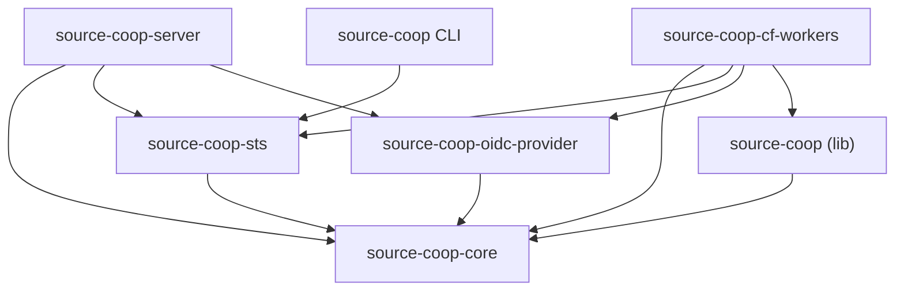

# Crate Layout

The project is organized as a Cargo workspace with libraries (traits and logic) and runtimes (executable targets).

```
crates/
├── cli/                                # source-coop CLI (OIDC login → STS credential exchange)
├── libs/                               # Libraries — not directly runnable
│   ├── core/  (source-coop-core)       # Runtime-agnostic: traits, S3 parsing, SigV4, config
│   ├── sts/   (source-coop-sts)        # OIDC/STS token exchange (AssumeRoleWithWebIdentity)
│   ├── oidc-provider/                  # Outbound OIDC provider (JWT signing, JWKS, exchange)
│   └── source-coop/                    # Source Cooperative resolver and API client
└── runtimes/                           # Runnable targets — one per deployment platform
    ├── server/ (source-coop-server)    # Tokio/Hyper for container deployments
    └── cf-workers/                     # Cloudflare Workers for edge deployments
```

## Crate Responsibilities

### `source-coop-core`

The runtime-agnostic core. Contains:
- `ProxyHandler` — Two-phase request handler (`resolve_request()` → `HandlerAction`)
- `RequestResolver` and `DefaultResolver` — Request parsing, SigV4 auth, authorization
- `ConfigProvider` trait and implementations (static file, HTTP, DynamoDB, Postgres)
- `ProxyBackend` trait — Runtime abstraction for store/signer/raw HTTP
- S3 request parsing, XML response building, list prefix rewriting
- SigV4 signature verification
- Sealed session token encryption/decryption
- Type definitions (`BucketConfig`, `RoleConfig`, `AccessScope`, etc.)

**Feature flags:**
- `config-http` — HTTP API config provider
- `config-dynamodb` — DynamoDB config provider
- `config-postgres` — PostgreSQL config provider
- `azure` — Azure Blob Storage support
- `gcp` — Google Cloud Storage support

### `source-coop-sts`

OIDC token exchange implementing `AssumeRoleWithWebIdentity`:
- JWT decoding and validation (RS256)
- JWKS fetching and caching
- Trust policy evaluation (issuer, audience, subject conditions)
- Temporary credential minting with scope template variables

### `source-coop-oidc-provider`

Outbound OIDC identity provider for backend authentication:
- RSA JWT signing (`JwtSigner`)
- JWKS endpoint serving
- OpenID Connect discovery document
- AWS credential exchange (`AwsOidcBackendAuth`)
- Credential caching

### `source-coop-server`

The native server runtime:
- Tokio/Hyper HTTP server
- `ServerBackend` implementing `ProxyBackend` with reqwest
- Streaming via hyper `Incoming` bodies and reqwest `bytes_stream()`
- CLI argument parsing (`--config`, `--listen`, `--domain`, `--sts-config`)

### `source-coop-cf-workers`

The Cloudflare Workers WASM runtime:
- `WorkerBackend` implementing `ProxyBackend` with `web_sys::fetch`
- `FetchConnector` bridging `object_store` HTTP to Workers Fetch API
- JS `ReadableStream` passthrough for zero-copy streaming
- Config loading from env vars (`PROXY_CONFIG`)

::: warning
This crate is excluded from the workspace `default-members` because WASM types are `!Send` and won't compile on native targets. Always build with `--target wasm32-unknown-unknown`.
:::

### `source-coop` (lib)

Source Cooperative-specific resolver and API client:
- `SourceCoopResolver` — Custom namespace mapping (`/{account}/{repo}/{key}`)
- External auth via Source Cooperative API

### `cli`

Command-line tool for OIDC authentication:
- Browser-based OAuth2 Authorization Code + PKCE flow
- `credential_process` integration with AWS SDKs
- Credential caching in `~/.source-coop/credentials/`

## Dependency Flow



Libraries define trait abstractions. Runtimes implement `ProxyBackend` with platform-native primitives and wire everything together.
