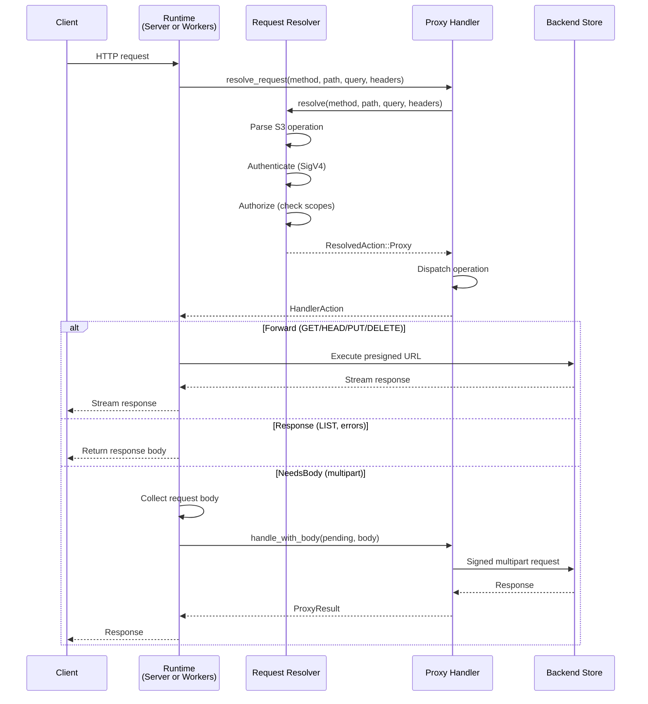

# Request Lifecycle

Every S3 request flows through a two-phase dispatch model: first the request is resolved (parsed, authenticated, authorized), then the appropriate action is executed by the runtime.

## Overview

## Phase 1: Request Resolution

The `RequestResolver` determines what to do with an incoming request. The `DefaultResolver` handles standard S3 proxy behavior:

1. **Parse the S3 operation** from the HTTP method, path, query, and headers
   - Path-style: `GET /bucket/key` → GetObject on `bucket` with key `key`
   - Virtual-hosted: `GET /key` with `Host: bucket.s3.example.com` → same operation
2. **Authenticate** the request by verifying the SigV4 signature against stored or sealed credentials
3. **Authorize** by checking the caller's access scopes against the requested bucket, key prefix, and operation
4. **Return** a `ResolvedAction`:
   - `Proxy { operation, bucket_config, list_rewrite }` — forward to a backend
   - `Response { status, headers, body }` — return a synthetic response (e.g., `ListBuckets`)

Custom resolvers can implement entirely different routing, authentication, and namespace mapping.

## Phase 2: Handler Dispatch

The `ProxyHandler` takes the resolved action and dispatches it based on the S3 operation type. It returns a `HandlerAction` enum:

### `Forward(ForwardRequest)`

Used for: **GET, HEAD, PUT, DELETE**

The handler generates a presigned URL using the backend's `Signer` and returns it to the runtime with filtered headers. The runtime executes the presigned URL with its native HTTP client, streaming request and response bodies directly. The handler never touches the body data.

- Presigned URL TTL: 300 seconds
- Headers forwarded: `range`, `if-match`, `if-none-match`, `if-modified-since`, `if-unmodified-since`, `content-type`, `content-length`, `content-md5`, `content-encoding`, `content-disposition`, `cache-control`, `x-amz-content-sha256`

### `Response(ProxyResult)`

Used for: **LIST, errors, synthetic responses**

For LIST operations, the handler calls `object_store::list_with_delimiter()` via the backend's store, builds S3 `ListObjectsV2` XML from the results, and returns it as a complete response. If a `ListRewrite` is configured, key prefixes are transformed in the XML.

> [!NOTE]
> LIST returns all results in a single response. `IsTruncated` is always `false`. The proxy does not support S3-style pagination with continuation tokens.

### `NeedsBody(PendingRequest)`

Used for: **CreateMultipartUpload, UploadPart, CompleteMultipartUpload, AbortMultipartUpload**

Multipart operations need the request body (e.g., the XML body for `CompleteMultipartUpload`). The runtime materializes the body, then calls `handler.handle_with_body()`, which signs the request using `S3RequestSigner` and sends it via `backend.send_raw()`.

> [!WARNING]
> Multipart uploads are only supported for `backend_type = "s3"`. Non-S3 backends should use single PUT requests (object_store handles chunking internally).

## Response Header Forwarding

The proxy forwards only specific headers from the backend response to the client:

`content-type`, `content-length`, `content-range`, `etag`, `last-modified`, `accept-ranges`, `content-encoding`, `content-disposition`, `cache-control`, `x-amz-request-id`, `x-amz-version-id`, `location`

All other backend headers are filtered out.
