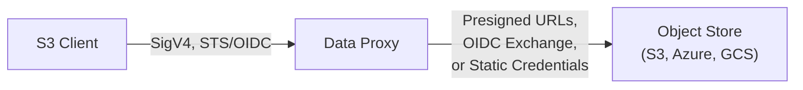

# Authentication

The Source Data Proxy has two distinct authentication concerns:

1. **Client authentication** — How clients prove their identity to the proxy
2. **Backend authentication** — How the proxy authenticates with backend object stores

## Client Authentication

Clients authenticate with the proxy using one of three methods:

| Method | Use Case | How It Works |
|--------|----------|--------------|
| **Anonymous** | Public datasets | No credentials needed for GET/HEAD/LIST |
| **Long-lived access keys** | Service accounts, internal tools | Static `AccessKeyId`/`SecretAccessKey` with SigV4 signing |
| **OIDC/STS temporary credentials** | CI/CD, user sessions, federated identity | Exchange a JWT from an OIDC provider for scoped temporary credentials |

The proxy verifies all signed requests using standard AWS Signature Version 4 (SigV4). Any S3-compatible client works without modification — just set the endpoint URL.

The OIDC/STS flow is the recommended approach for most use cases. See [Client Auth Setup](./proxy-auth) for configuration details.

## Backend Authentication

The proxy authenticates with backend object stores using one of two methods:

| Method | Use Case | How It Works |
|--------|----------|--------------|
| **Static credentials** | Simple setups | `access_key_id`/`secret_access_key` stored in the proxy config |
| **OIDC backend auth** | Production, credential-free | Proxy acts as its own OIDC provider, exchanges self-signed JWTs for cloud credentials |

OIDC backend auth eliminates the need to store long-lived backend credentials. See [Backend Auth](./backend-auth) for details.

## Related Topics

- [Sealed Session Tokens](./sealed-tokens) — How temporary credentials are encrypted for stateless runtimes
- [User Guide: Authentication](/guide/authentication) — User-facing guide for obtaining credentials and using the CLI
