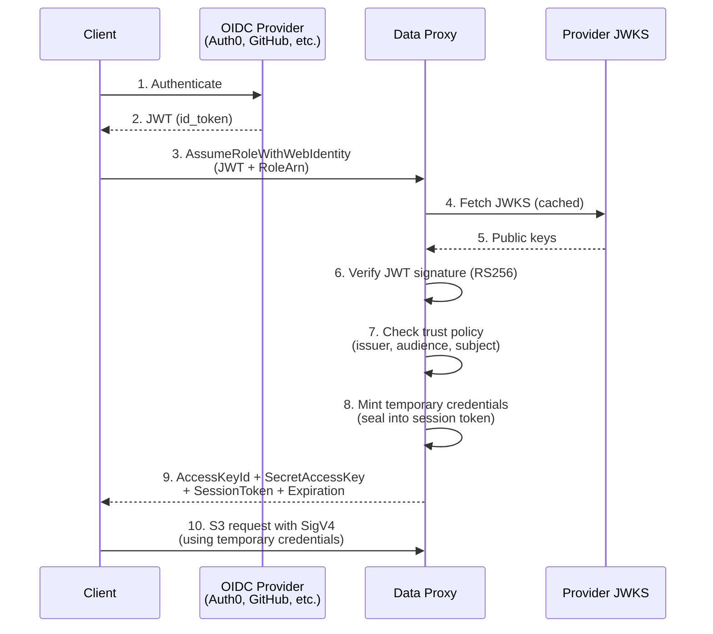

# Client Authentication Setup

This page covers how to configure the proxy to authenticate incoming client requests. For the user-facing guide on obtaining credentials and using the CLI, see the [User Guide: Authentication](/guide/authentication).

## Authentication Modes

The proxy supports three authentication modes:

| Mode | Config | Use Case |
|------|--------|----------|
| **Anonymous** | `anonymous_access = true` on a bucket | Public datasets, open data |
| **Long-lived access keys** | `[[credentials]]` entries | Service accounts, internal tools |
| **OIDC/STS temporary credentials** | `[[roles]]` with trust policies | CI/CD, user sessions, federated identity |

## Anonymous Access

Enable per-bucket:

```toml
[[buckets]]
name = "public-data"
backend_type = "s3"
anonymous_access = true
```

Anonymous access only allows `GetObject`, `HeadObject`, and `ListBucket`. Write operations always require authentication.

## Long-Lived Access Keys

Static credentials are defined in the config. Each has an access key pair and scoped permissions:

```toml
[[credentials]]
access_key_id = "AKPROXY00000EXAMPLE"
secret_access_key = "proxy/secret/key/EXAMPLE000000000000"
principal_name = "internal-dashboard"
created_at = "2024-01-15T00:00:00Z"
enabled = true

[[credentials.allowed_scopes]]
bucket = "ml-artifacts"
prefixes = ["models/production/"]
actions = ["get_object", "head_object"]
```

Clients sign requests using standard AWS SigV4. Any S3-compatible client works without modification.

## OIDC/STS Temporary Credentials

This is the recommended authentication method. Clients exchange a JWT from an OIDC-compatible identity provider for scoped, time-limited credentials via `AssumeRoleWithWebIdentity`.

### How It Works



### Verification Flow

When a client calls `AssumeRoleWithWebIdentity`:

1. The proxy decodes the JWT header to extract the `iss` (issuer) and `kid` (key ID)
2. The proxy verifies the issuer is trusted by the requested role
3. The proxy fetches the issuer's JWKS endpoint and verifies the JWT signature (RS256)
4. The proxy evaluates the trust policy:
   - **Issuer**: must be in the role's `trusted_oidc_issuers`
   - **Audience**: if `required_audience` is set on the role, the token's `aud` claim must match
   - **Subject**: the token's `sub` claim must match at least one of the role's `subject_conditions` (supports `*` glob wildcards)
5. The proxy mints temporary credentials scoped to the role's `allowed_scopes`
6. If `SESSION_TOKEN_KEY` is configured, the credentials are AES-256-GCM encrypted into the session token (see [Sealed Session Tokens](./sealed-tokens))
7. The proxy returns the credentials in an XML response matching the AWS STS format

### STS Request Parameters

| Parameter | Required | Description |
|-----------|----------|-------------|
| `Action` | Yes | Must be `AssumeRoleWithWebIdentity` |
| `RoleArn` | Yes | The `role_id` of the role to assume |
| `WebIdentityToken` | Yes | The JWT from the OIDC provider |
| `DurationSeconds` | No | Session duration (900s minimum, capped by `max_session_duration_secs`) |

### STS Response

The response follows the standard AWS STS XML format:

```xml
<AssumeRoleWithWebIdentityResponse>
  <AssumeRoleWithWebIdentityResult>
    <Credentials>
      <AccessKeyId>STSPRXY...</AccessKeyId>
      <SecretAccessKey>...</SecretAccessKey>
      <SessionToken>...</SessionToken>
      <Expiration>2024-01-15T01:00:00Z</Expiration>
    </Credentials>
    <AssumedRoleUser>
      <Arn>github-actions-deployer/alice</Arn>
      <AssumedRoleId>github-actions-deployer</AssumedRoleId>
    </AssumedRoleUser>
  </AssumeRoleWithWebIdentityResult>
</AssumeRoleWithWebIdentityResponse>
```

## Integrating with OIDC Providers

The proxy works with any OIDC-compliant identity provider that serves a JWKS endpoint and issues RS256-signed JWTs. You need:

1. The provider's issuer URL (must serve `/.well-known/openid-configuration` with a `jwks_uri`)
2. The `sub` claim format for configuring `subject_conditions`
3. Optionally, the audience claim value for `required_audience`

<details>
<summary><strong>GitHub Actions</strong> — OIDC tokens for CI/CD workflows</summary>

#### Role Configuration

```toml
[[roles]]
role_id = "github-actions-deployer"
name = "GitHub Actions Deploy Role"
trusted_oidc_issuers = ["https://token.actions.githubusercontent.com"]
required_audience = "sts.s3proxy.example.com"
subject_conditions = [
    "repo:myorg/myapp:ref:refs/heads/main",
    "repo:myorg/myapp:ref:refs/heads/release/*",
]
max_session_duration_secs = 3600

[[roles.allowed_scopes]]
bucket = "deploy-bundles"
prefixes = []
actions = ["get_object", "head_object", "put_object"]
```

#### Workflow Example

```yaml
jobs:
  deploy:
    permissions:
      id-token: write  # Required for OIDC token
    steps:
      - name: Get OIDC token
        id: oidc
        run: |
          TOKEN=$(curl -s \
            -H "Authorization: bearer $ACTIONS_ID_TOKEN_REQUEST_TOKEN" \
            "$ACTIONS_ID_TOKEN_REQUEST_URL&audience=sts.s3proxy.example.com" \
            | jq -r '.value')
          echo "token=$TOKEN" >> $GITHUB_OUTPUT

      - name: Assume role via STS
        run: |
          CREDS=$(aws sts assume-role-with-web-identity \
            --role-arn github-actions-deployer \
            --web-identity-token ${{ steps.oidc.outputs.token }} \
            --endpoint-url https://s3proxy.example.com \
            --output json)

          echo "AWS_ACCESS_KEY_ID=$(echo $CREDS | jq -r '.Credentials.AccessKeyId')" >> $GITHUB_ENV
          echo "AWS_SECRET_ACCESS_KEY=$(echo $CREDS | jq -r '.Credentials.SecretAccessKey')" >> $GITHUB_ENV
          echo "AWS_SESSION_TOKEN=$(echo $CREDS | jq -r '.Credentials.SessionToken')" >> $GITHUB_ENV

      - name: Upload to proxy
        run: |
          aws s3 cp ./bundle.tar.gz s3://deploy-bundles/releases/v1.2.3.tar.gz \
            --endpoint-url https://s3proxy.example.com
```

#### Key Details

- **Issuer URL**: `https://token.actions.githubusercontent.com`
- **Subject format**: `repo:{owner}/{repo}:ref:{ref}` (e.g., `repo:myorg/myapp:ref:refs/heads/main`)
- **Audience**: configurable via the `&audience=` parameter in the token request URL
- The `id-token: write` permission is required in the workflow

</details>

<details>
<summary><strong>Auth0</strong> — OAuth2/OIDC identity platform</summary>

#### Auth0 Setup

1. Create an Application (Regular Web Application or SPA) in your Auth0 dashboard
2. Note your Auth0 domain — this is the issuer URL

#### Role Configuration

```toml
[[roles]]
role_id = "auth0-user"
name = "Auth0 User"
trusted_oidc_issuers = ["https://your-tenant.auth0.com/"]
required_audience = "https://s3proxy.example.com"
subject_conditions = ["*"]  # Or restrict by user ID patterns
max_session_duration_secs = 3600

[[roles.allowed_scopes]]
bucket = "{sub}"
prefixes = []
actions = ["get_object", "head_object", "put_object", "list_bucket"]
```

#### Key Details

- **Issuer URL**: `https://your-tenant.auth0.com/` (trailing slash required)
- **Subject claim**: Auth0 user ID (e.g., `auth0|507f1f77bcf86cd799439011`)
- **Audience**: set when requesting the token via the `audience` parameter

</details>

<details>
<summary><strong>Keycloak</strong> — Open-source identity and access management</summary>

#### Keycloak Setup

1. Create a Realm and a Client in your Keycloak admin console
2. Set the client's Access Type to `public` or `confidential` as needed
3. Enable "Standard Flow" (Authorization Code)

#### Role Configuration

```toml
[[roles]]
role_id = "keycloak-user"
name = "Keycloak User"
trusted_oidc_issuers = ["https://keycloak.example.com/realms/myrealm"]
subject_conditions = ["*"]
max_session_duration_secs = 3600

[[roles.allowed_scopes]]
bucket = "{sub}"
prefixes = []
actions = ["get_object", "head_object", "put_object", "list_bucket"]
```

#### Key Details

- **Issuer URL**: `https://keycloak.example.com/realms/{realm-name}`
- **Subject claim**: Keycloak user UUID
- **JWKS**: served at `{issuer}/protocol/openid-connect/certs`

</details>

<details>
<summary><strong>AWS Cognito</strong> — AWS-managed identity service</summary>

#### Cognito Setup

1. Create a User Pool in the AWS Cognito console
2. Create an App Client (no client secret for public clients)
3. Configure the Hosted UI or use the Cognito SDK for authentication

#### Role Configuration

```toml
[[roles]]
role_id = "cognito-user"
name = "Cognito User"
trusted_oidc_issuers = ["https://cognito-idp.us-east-1.amazonaws.com/us-east-1_EXAMPLE"]
subject_conditions = ["*"]
max_session_duration_secs = 3600

[[roles.allowed_scopes]]
bucket = "{sub}"
prefixes = []
actions = ["get_object", "head_object", "put_object", "list_bucket"]
```

#### Key Details

- **Issuer URL**: `https://cognito-idp.{region}.amazonaws.com/{user-pool-id}`
- **Subject claim**: Cognito user UUID
- **Audience**: the App Client ID (set `required_audience` to match)

</details>

<details>
<summary><strong>Ory / Ory Network</strong> — Open-source OAuth2/OIDC infrastructure</summary>

#### Ory Setup

1. Create an OAuth2 client as a **public client** (no client secret)
2. Set the grant type to Authorization Code with PKCE
3. Register `http://127.0.0.1/callback` as a redirect URI (any port is allowed per RFC 8252)
4. Set allowed scopes to include `openid`

#### Role Configuration

```toml
[[roles]]
role_id = "ory-user"
name = "Ory User"
trusted_oidc_issuers = ["https://your-project.projects.oryapis.com"]
subject_conditions = ["*"]
max_session_duration_secs = 3600

[[roles.allowed_scopes]]
bucket = "{sub}"
prefixes = []
actions = ["get_object", "head_object", "put_object", "list_bucket"]
```

#### Key Details

- **Issuer URL**: `https://your-project.projects.oryapis.com` (Ory Network) or your self-hosted Hydra URL
- **Subject claim**: Ory identity UUID
- The CLI (`source-coop login`) works well with Ory since Ory follows RFC 8252 for loopback redirect URIs

</details>

## Template Variables in Scopes

Role scopes support `{claim_name}` template variables that are resolved from the authenticated user's JWT claims when credentials are minted. This enables per-user access without creating a separate role for each user.

```toml
[[roles]]
role_id = "source-coop-user"
trusted_oidc_issuers = ["https://auth.source.coop"]
subject_conditions = ["*"]
max_session_duration_secs = 3600

# Each user gets access to a bucket matching their OIDC subject
[[roles.allowed_scopes]]
bucket = "{sub}"
prefixes = []
actions = ["get_object", "head_object", "put_object", "list_bucket"]
```

A user with `sub = "alice"` receives credentials scoped to `bucket = "alice"`. Any string claim from the JWT can be referenced — `{email}`, `{org}`, etc. Missing or non-string claims resolve to an empty string, which safely fails authorization.

You can also use template variables in prefixes for more granular access:

```toml
[[roles.allowed_scopes]]
bucket = "shared-data"
prefixes = ["{org}/"]
actions = ["get_object", "head_object", "put_object", "list_bucket"]
```
