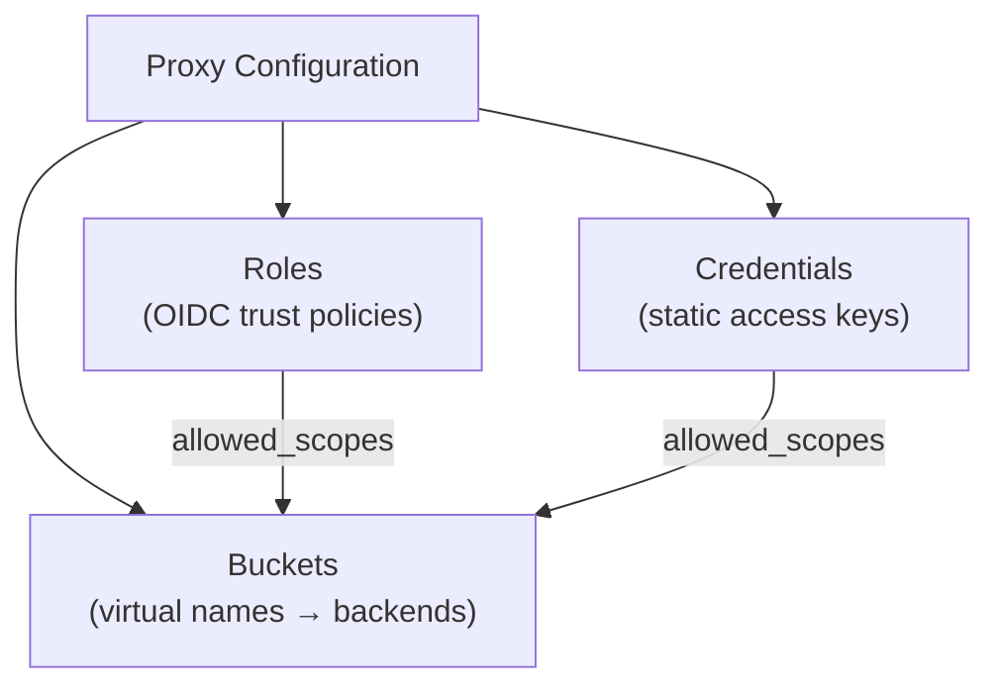

# Configuration

The proxy configuration defines three things:

1. **[Buckets](./buckets)** — Virtual buckets that map client-visible names to backend object stores
2. **[Roles](./roles)** — Trust policies for OIDC token exchange via `AssumeRoleWithWebIdentity`
3. **[Credentials](./credentials)** — Long-lived access keys for service accounts and internal tools



## Config Format

The server runtime uses TOML:

```toml
[[buckets]]
name = "public-data"
backend_type = "s3"
anonymous_access = true

[buckets.backend_options]
endpoint = "https://s3.us-east-1.amazonaws.com"
bucket_name = "my-public-assets"
region = "us-east-1"
```

The CF Workers runtime uses JSON (as an environment variable or `wrangler.toml` object):

```json
{
  "buckets": [{
    "name": "public-data",
    "backend_type": "s3",
    "anonymous_access": true,
    "backend_options": {
      "endpoint": "https://s3.us-east-1.amazonaws.com",
      "bucket_name": "my-public-assets",
      "region": "us-east-1"
    }
  }]
}
```

## Config Providers

The proxy can load configuration from multiple backends. See [Config Providers](./providers/) for details.

| Provider | Feature Flag | Use Case |
|----------|-------------|----------|
| [Static File](./providers/static-file) | (always available) | Simple deployments, baked-in config |
| [HTTP API](./providers/http) | `config-http` | Centralized config service |
| [DynamoDB](./providers/dynamodb) | `config-dynamodb` | AWS-native infrastructure |
| [PostgreSQL](./providers/postgres) | `config-postgres` | Database-backed config |

All providers can be wrapped with a [cache](./providers/cached) for performance.

## Full Example

See the [annotated config example](/reference/config-example) for a complete configuration file with all options documented.
