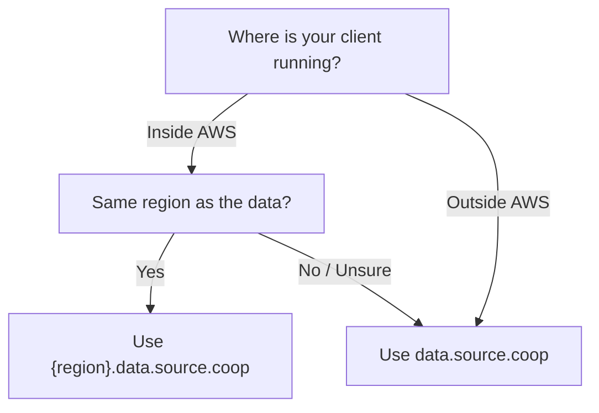

# Endpoints

Source Cooperative runs two types of proxy deployments. Choosing the right endpoint can significantly improve throughput and reduce costs.

## Global Endpoint (Cloudflare Workers)

```
https://data.source.coop
```

The primary endpoint runs on Cloudflare Workers at the edge. This is the default for most use cases:

- **Global availability** — Requests are handled by the nearest Cloudflare edge location
- **Backbone routing** — Traffic between Cloudflare and AWS travels over Cloudflare's private backbone network rather than the public internet, improving throughput and reliability
- **Best for** — Workstations, laptops, CI/CD outside AWS, or any client not running inside an AWS region

```bash
aws s3 cp s3://my-bucket/data.parquet ./data.parquet \
    --endpoint-url https://data.source.coop
```

## Regional Endpoints (AWS Servers)

```
https://{region}.data.source.coop
```

For workloads running inside AWS, zone-specific server deployments are available. These run as native Tokio/Hyper servers within the same AWS region as the backend storage:

| Endpoint | Region |
|----------|--------|
| `us-west-2.data.source.coop` | US West (Oregon) |
| `us-east-1.data.source.coop` | US East (N. Virginia) |

Regional endpoints provide two major advantages:

- **Higher throughput** — Traffic stays within the AWS network, avoiding internet bottlenecks. This is especially impactful for large file transfers and batch processing workloads
- **No egress fees** — Data transferred between S3 and an EC2 instance (or other AWS service) in the same region incurs no AWS data transfer charges. Using the global endpoint from within AWS would route traffic out through Cloudflare and back, incurring egress fees on both legs

### When to Use Regional Endpoints

Use a regional endpoint when your client is running inside the same AWS region as the data:

- **EC2 instances** processing datasets stored in the same region
- **SageMaker notebooks** or training jobs accessing training data
- **Lambda functions** reading/writing data in batch pipelines
- **ECS/EKS workloads** performing ETL or analytics
- **AWS Batch** jobs processing large datasets

```bash
# From an EC2 instance in us-west-2
aws s3 cp s3://my-bucket/large-dataset.parquet ./data.parquet \
    --endpoint-url https://us-west-2.data.source.coop
```

### AWS Profile Configuration

Set up profiles for both global and regional access:

```ini
# For general use (laptop, CI/CD outside AWS)
[profile source-coop]
credential_process = source-coop credential-process
endpoint_url = https://data.source.coop

# For workloads in us-west-2
[profile source-coop-usw2]
credential_process = source-coop credential-process
endpoint_url = https://us-west-2.data.source.coop
```

```bash
# From your laptop
aws s3 ls s3://my-bucket/ --profile source-coop

# From an EC2 instance in us-west-2
aws s3 ls s3://my-bucket/ --profile source-coop-usw2
```

## Choosing an Endpoint



| Scenario | Recommended Endpoint | Why |
|----------|---------------------|-----|
| Laptop or workstation | `data.source.coop` | Cloudflare backbone optimizes global routing |
| GitHub Actions / CI | `data.source.coop` | CI runners are typically outside AWS |
| EC2 in us-west-2, data in us-west-2 | `us-west-2.data.source.coop` | Same-region: max throughput, zero egress |
| EC2 in us-east-1, data in us-west-2 | `data.source.coop` | Cross-region: Cloudflare backbone is faster than cross-region AWS traffic |
| SageMaker in us-west-2 | `us-west-2.data.source.coop` | Same-region: zero egress for training data |

::: tip
All endpoints support the same authentication methods and S3 operations. Your credentials work across any endpoint — only the `endpoint_url` changes.
:::
