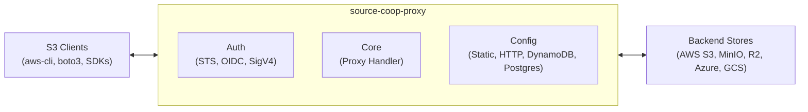

## Why a Proxy?

Source Cooperative hosts open data from researchers and organizations around the world. That data lives on object storage — but object storage alone doesn't solve the problems that come with making data truly accessible.

### One URL, any backend

A dataset might start on AWS S3, move to Cloudflare R2 to reduce egress costs, or get mirrored across providers for redundancy. The proxy gives every data product a stable URL (`data.source.coop/{account}/{dataset}/...`) regardless of where the bytes actually live. Backend migrations are invisible to consumers — no broken links, no client reconfiguration.

### Native S3 compatibility

Rather than inventing a new API, the proxy speaks the S3 protocol. This means the entire ecosystem of existing tools — `aws-cli`, `boto3`, DuckDB, the Rust `object_store` crate, GDAL, and hundreds of others — works out of the box. Users don't install a custom client or learn a new SDK. They just set an endpoint URL.

### Metered access

Open data should be free and open to humans, but without guardrails a single runaway script can rack up thousands of dollars in egress charges. The proxy enables metered access — enforcing limits on how much data a given identity can consume in a window of time. Public datasets stay freely accessible while the infrastructure stays sustainable.

### Flexible authentication

The proxy supports two layers of OIDC-based auth that eliminate long-lived credentials:

- **Frontend**: Third-party identity providers (GitHub Actions, Auth0, Keycloak) can exchange OIDC tokens for scoped, time-limited proxy credentials — enabling machine-to-machine workflows like ETL pipelines and CI/CD without sharing static keys.
- **Backend**: The proxy acts as its own OIDC identity provider to authenticate with cloud storage backends, replacing long-lived access keys with short-lived credentials obtained via token exchange.

### Run anywhere

The same core logic compiles to a native Tokio/Hyper server for container deployments and to WebAssembly for Cloudflare Workers at the edge. Choose the runtime that fits your infrastructure — or run both.

## How It Works

The proxy sits between S3-compatible clients and backend object stores. It authenticates incoming requests, authorizes them against configured scopes, and forwards them to the appropriate backend using presigned URLs for zero-copy streaming.
